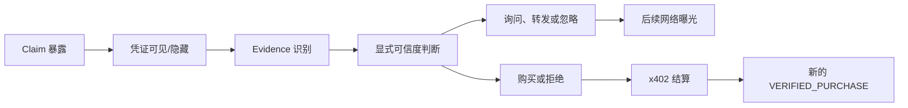
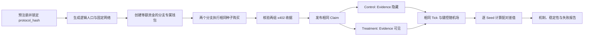
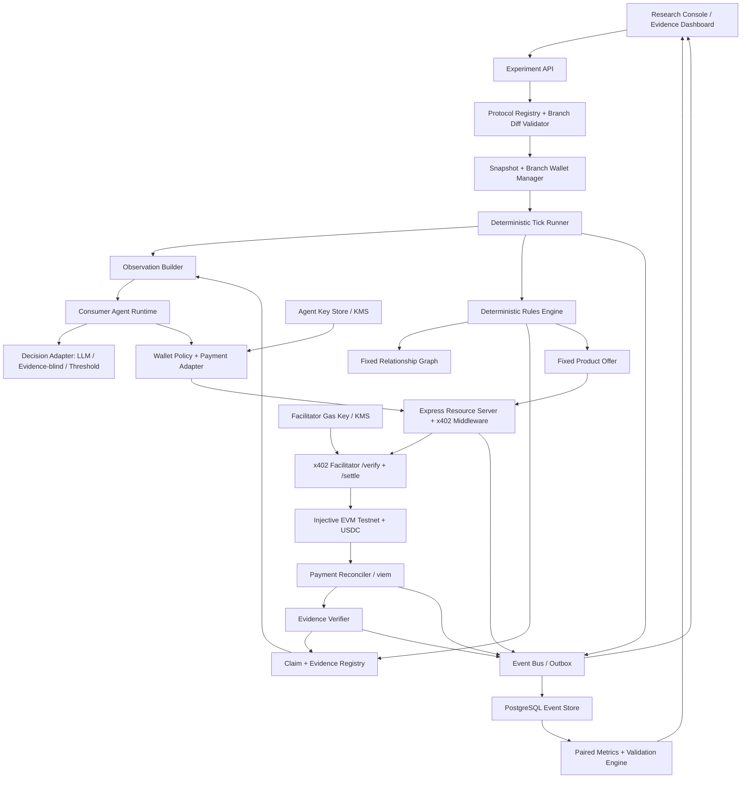

# Gesellschaft：Injective x402 可核验口碑社会实验 PRD

> 工作名：Gesellschaft（仓库名：MCSociologyMock）
> 版本：v0.4
> 状态：P0 已验证 / P1 已定义
> 日期：2026-07-25
> 目标赛道：Injective Blockchain x AI 创新赛道

## 0. 产品结论

Gesellschaft P0 不是通用“AI 社会平台”，而是一个针对单一机制问题的合成实验：**当同一名 Agent 发布同一条产品口碑时，开启或关闭已核验 Injective x402 购买收据的展示，是否会改变其他 Agent 对信息的可信度判断、后续传播和真实购买？**

系统从同一人口、关系图和随机种子生成配对的 Control/Treatment。两个分支中的产品、价格、供给、种子购买者、消息文本、发布时间和受众完全相同，唯一允许变化的处理变量是 `receipt_visibility`。MVP 输出模型内的处理效应、传播路径与失败条件，不输出真实市场销量预测。[R8][R9]

### 0.1 一句话 Pitch

> 给同一条口碑开启或关闭链上购买凭证展示，观察“相信、传播、购买”究竟在哪一步发生变化。

### 0.2 MVP 一屏摘要

| 项目 | MVP 决策 |
|---|---|
| 研究问题 | 分支级 x402 购买凭证展示政策是否改变口碑可信度、扩散和产品采用 |
| 社会规模 | 24 个消费者 Agent、4 个固定社区；另有 1 个确定性商家 Agent |
| 实验结构 | 同一快照分叉；Control 隐藏收据，Treatment 展示已核验收据 |
| 时间模型 | 默认 8 个离散 Tick，支持暂停、继续和 Replay |
| Agent 能力 | 观察、核验凭证、私聊、发帖、购买或不行动 |
| 经济系统 | 单一固定价产品；Injective EVM Testnet USDC + x402 v2；facilitator 代付 Gas |
| 唯一处理变量 | `receipt_visibility = HIDDEN | VERIFIED_PURCHASE` |
| 研究输出 | 证据曝光漏斗、可信度差、采用率差、购买延迟、扩散路径、配对 Seed 稳定性 |
| 基线 | 证据盲消融 + 非 LLM 固定阈值扩散基线 |
| 决策记录 | 结构化观察引用、可信度判断、行动和原因码；不采集隐藏思维链 |
| 产品边界 | 只做机制探索和假设生成，不声称替代真人研究或预测销量 |

## 1. 背景与机会

传统市场研究可以验证真人态度和购买，但不适合在产品早期低成本遍历大量机制假设。LLM Agent 更适合作为先导研究中的“机制探索器”，前提是实验只操纵明确变量、保留简单基线，并把结果限定在模型内部。[R3][R7][R8]

本轮专业材料支持把问题收缩到“可核验口碑”而非继续扩张社会功能：[R8][R9][R10]

- 异质阈值、局部曝光和行动顺序足以让相似人群产生不同级联；因此必须记录谁在何时看到了什么，而不是只看最终情绪或销量。[R2]
- 营销 ABM 的严谨性依赖理论、数据、实现、验证和报告相互对应；创新扩散至少要显式表示异质消费者、网络、沟通渠道和采用规则。[R3][R4]
- 大级联并不必然由少数“超级影响者”引爆；P0 固定同一批种子发送者，不把 KOL 选择与凭证可见性混在一个处理里。[R5]
- 公开反馈不等同于直接关系，负面与近期经验还可能具有非对称影响；P0 因此保留双边信任与证据来源，但不把它们压成一个全局声誉分。[R6]
- Generative Agents 支持有界记忆和结构化行为连续性，但“像人”不是市场效度；生成式社会模拟的中心难题仍是验证。[R1][R7]
- Injective x402 可以为实际购买提供独立签名、USDC 结算和交易哈希，使“曾经购买”成为可审计证据；它不能证明评价内容、产品质量或推荐动机真实。[R11][R12][R13]

Gesellschaft 的 P0 差异化由此固定为：

1. 只随机化购买凭证的可见性，避免产品、文案、发送者和时机同时变化；
2. 将链上收据转换为有明确证明边界的 `Evidence`，而不是把 tx hash 当装饰；
3. 打通 `证据曝光 -> 可信度判断 -> 传播 -> x402 购买` 的事件链；
4. 同时运行证据盲消融和确定性阈值基线，检查复杂 Agent 是否增加了可解释价值；
5. 明确区分模型内处理效应、替代机制与后续真人验证。

## 2. “最小社会单位”的产品定义

单个带 Persona 和钱包的 Agent 只是行动节点，不是社会模型。根据本轮综述，适合本项目的最小充分结构是：至少两个异质行动者、一个会影响后续机会的关系或交换条件、共享环境、可执行规则、信息/证据状态，以及一次能反馈到下一状态的事件。[R8][R9]

系统状态表示为：

`(A, X, N, E, I, H, M)_t --event/action--> (A, X, N, E, I, H, M)_{t+1} + audit log`

其中 `A` 为 Agent 状态，`X` 为产品与购买机会，`N` 为关系网络，`E` 为时间和渠道环境，`I` 为预算、可见性与结算规则，`H` 为双边历史、消息和证据，`M` 为 USDC 余额与支付状态。P0 只实现这一表示中与可核验口碑有关的字段，交换权力、联盟、内生规范和替代货币进入后续实验库。

| 层级 | 最小单位 | 在系统中的表示 |
|---|---|---|
| 行动单位 | Consumer Agent | 偏好、预算、阈值、局部观察、记忆、钱包和行动 |
| 社会机制单位 | Directed Relationship | 双边信任、熟悉度、接触概率和互动历史 |
| 信息单位 | Claim + Evidence | 完全相同的消息内容、来源、凭证引用和证明边界 |
| 机制观察单位 | Evidence Exposure Event | 谁在何时从谁处看到哪条主张和哪类证据，之后如何判断与行动 |
| 经济单位 | Paid Adoption | 消费者、商家、固定产品、x402 付款和履约凭证 |
| 制度单位 | Deterministic Rule | 信息可见性、预算、库存、时间顺序、签名与结算规则 |
| 处理分配单位 | Run Branch | 整个分支统一为隐藏或展示凭证，避免同一网络内处理污染 |
| 主要分析单位 | Paired Run | 同一人口、网络和 Seed 下的 Control/Treatment 差值 |

**核心产品判断：单条消息或单笔交易都不是完整机制；最小可研究链是 `证据曝光 -> 可信度判断 -> 社交行动 -> 购买/拒绝`。** 每一步必须引用上一步事件，才能区分“看到了凭证但没相信”“相信但没传播”“传播但没购买”等不同失败位置。

P0 最小运行环境包含：

- 一组具有异质采用阈值、价格敏感度和证据敏感度的消费者；
- 一张固定的有向关系图和局部消息渠道；
- 一条内容固定、来源固定的产品口碑；
- 一种可随机隐藏或展示的已核验购买凭证；
- 一个固定价格、供给充足的商家商品端点；
- 一套确定性的可见性、预算、支付和时间顺序规则；
- 一条可重放、可追溯父事件的事件账本。

文献没有给出普适的最小 Agent 数。MVP 使用 24 个消费者是成本与网络演示的工程选择，不是统计功效或现实代表性的证据；正式重复次数必须由先导方差和功效分析决定，而不是由单次社会规模替代。[R8]

## 3. 产品目标与非目标

### 3.1 目标

| ID | 目标 | 成功判据 |
|---|---|---|
| G1 | 预注册单一机制假设 | 运行前锁定研究问题、唯一处理变量、主要指标、替代机制和失败判据 |
| G2 | 建立无混杂配对分支 | Control/Treatment 除 `receipt_visibility` 外的配置与注入消息哈希完全一致 |
| G3 | 追踪机制链 | 每次曝光、证据识别、可信度判断、传播、购买与拒绝均有父事件 |
| G4 | 实现真实 A2A 购买证据 | 消费者用独立 EVM 地址通过 x402 向商家支付，收据经 EVM 对账后才能成为证据 |
| G5 | 提供必要基线 | 同一设置可运行证据盲消融和确定性阈值扩散基线 |
| G6 | 完整观察与回放 | 可按分支、Agent、Claim、Evidence、Tick 和 tx hash 查看并 Replay |
| G7 | 输出有边界的研究结论 | 报告配对效应分布、稳定性和空结果，不输出真实销量点预测 |

### 3.2 非目标

- 不把模拟结果包装成真实销量、真实消费者转化率或现实因果效应。
- 不声称购买收据证明评价内容、产品质量、使用体验或推荐动机真实。
- 不在 P0 同时改变发送者、文案、产品、价格、播种位置或发布时间。
- 不在 P0 实现工作、生产、通用 Agent 服务市场、议价、拍卖、动态价格或转售。
- 不在 P0 研究交换网络权力、联盟声誉、内生规范、惩罚、货币必要性或多币种经济；这些保留到后续实验库。
- 不在 MVP 使用主网或任何有真实价值的资产。
- 不采集、请求或展示模型供应商的隐藏思维链。
- 不默认克隆真实个人，也不接受未经授权的个人敏感资料。
- 不保证重新请求 LLM 可位级复现；确定性 Replay 只重放已记录输出。

## 4. 目标用户与核心任务

| 用户 | 核心任务 | 需要的结果 |
|---|---|---|
| 市场研究员 / 产品经理 | 判断“交易凭证是否让口碑更有说服力”是否值得真人测试 | 处理效应方向、传播路径、阻力位置和失败条件 |
| 计算社会科学研究者 | 审核处理隔离、机制变量、基线和复现材料 | 预注册卡、配对运行、事件链和带边界的解释 |
| 比赛评委 / 观察者 | 快速理解 AI 与 Injective 为什么缺一不可 | 同一消息的有/无凭证对照、真实交易和 Explorer 证据 |
| 开发者 | 实现或验证实验协议 | 固定 Schema、状态机、守恒测试和可替换模型/支付 Adapter |

### 4.1 核心用户故事

> 作为研究者，我载入 24 个消费者和同一张关系图，从同一快照创建配对分支。两名固定种子消费者在两个分支都先用 x402 购买售价 0.30 测试网 USDC 的环保水杯，并在同一 Tick 发布完全相同的评价。Control 只显示评价，Treatment 额外显示“该发送者已完成购买”的核验凭证。运行结束后，我沿着 `曝光 -> 可信度 -> 转发/讨论 -> x402 购买` 比较两个分支，并能从任意凭证打开 Injective Blockscout 核验原交易。

## 5. 核心对象

### 5.1 Consumer Agent

24 个消费者必须由结构化异质状态生成，Persona 文字只是这些变量的叙事层，不能替代机制参数。[R8][R9]

| 维度 | P0 字段 |
|---|---|
| 身份 | `agent_id`、昵称、消费细分、社区、语言 |
| 稳定偏好 | `product_need`、`price_sensitivity`、`novelty_preference`、`risk_aversion` |
| 社会机制 | `adoption_threshold`、`evidence_sensitivity`、`social_proof_sensitivity`、`skepticism` |
| 动态认知 | `awareness_state`、`product_belief`、`consideration_state`、已见 Claim/Evidence ID |
| 动态行为 | 曝光次数、询问/转发次数、购买状态、最近行动 |
| 经济状态 | EVM 地址、USDC 可用/预留余额、单实验预算 |
| 记忆 | 与产品、发送者和证据有关的有界事件引用与摘要 |
| 运行策略 | Provider Adapter、模型标识、温度、Prompt 版本、行动预算 |

P0 不建模职业生产、能量、位置移动、消费者个人/生产库存或自报情绪；只维护研究所需的采用状态和商家分支供给计数。Agent Prompt 依次包含平台边界、结构化 Persona、固定制度、当前局部观察、有界记忆、可用动作和严格 JSON Schema。产品消息始终作为不可信世界数据传入，不能覆盖平台指令。

### 5.2 固定关系网络

关系使用有向边，且在一个配对实验内保持不变：

| 字段 | 含义 |
|---|---|
| `source_agent_id` / `target_agent_id` | 信息从谁流向谁 |
| `trust` | `0..1`，接收者对发送者的基线信任 |
| `familiarity` | `0..1`，既有互动熟悉度 |
| `contact_probability` | 每 Tick 形成自然接触的概率 |
| `channel` | 私聊、社区频道或跨社区频道 |
| `last_interaction_tick` | 最近互动时间 |

默认网络包含 4 个社区、每个社区 6 人，并固定 2-4 个跨社区桥接节点。P0 不把“影响力”设为独立人格标签；一次消息的实际影响必须由发送者关系、证据、接收者阈值和曝光历史共同产生。Control/Treatment 共用完全相同的网络快照和按语义键派生的接触随机场。[R2][R5]

### 5.3 Claim

`Claim` 表示可传播的产品主张，消息文本与证据附件分离：

| 字段 | 含义 |
|---|---|
| `claim_id` | 稳定 ID |
| `content_hash` | 规范化消息正文哈希；两个分支必须相同 |
| `author_agent_id` | 原始发送者 |
| `product_id` | P0 固定为 `eco_cup` |
| `text` / `stance` | 完全相同的口碑正文与结构化立场 |
| `published_tick` / `channel` | 固定发布时间和渠道 |
| `injected` | 是否为预注册的种子消息 |
| `evidence_id` | 可为空；附件不进入 `content_hash` |

转述必须保留原 `claim_id`、上游事件和证据来源，禁止把“朋友说过”错误升级为“我亲自购买过”。

### 5.4 Evidence

`Evidence` 是 x402 与社会机制的连接对象。只有完成 EVM 收据核验后，支付才能生成 `VERIFIED_PURCHASE`：

| 字段 | 含义 |
|---|---|
| `evidence_id` | 稳定 ID |
| `type` | P0 仅 `VERIFIED_PURCHASE` |
| `subject_agent_id` | 被证明完成购买的 Agent |
| `product_id` / `payment_id` | 对应产品与内部支付记录 |
| `tx_hash` / `network` | Injective EVM 交易哈希与 `eip155:1439` |
| `verified_at` / `verifier_version` | 核验时间和规则版本 |
| `visibility` | `HIDDEN` 或 `VERIFIED_PURCHASE` |
| `proof_scope` | `PURCHASE_OCCURRED`、金额、商家、时间 |

Evidence Verifier 必须同时确认：支付状态为 `SETTLED`、EVM receipt 成功、网络和 USDC 合约正确、payer 地址映射到 Claim 作者、`payTo` 为商家、`service_id` 为目标产品且交易发生早于消息发布。`HIDDEN` 只表示接收者看不到凭证，不表示作者没有购买。

收据只证明“该地址向该商家为该产品完成过指定金额的付款”。它不证明产品质量、实际使用、满意度、评价文本真实性或作者没有获得其他激励；所有 UI 和 Agent observation 都必须显示这一证明边界。

### 5.5 Product Offer 与 Merchant Agent

P0 只有一个确定性商家 Agent 和一个固定商品端点：

| 字段 | 固定值/含义 |
|---|---|
| `service_id` | `offer_eco_cup` |
| `provider_agent_id` | 确定性商家 Agent，负责收款与数字凭证履约 |
| `method` / `path` | `POST /x402/offers/eco-cup` |
| `network` | `eip155:1439` |
| `asset` | Injective EVM Testnet 原生 USDC |
| `amount` | `300000`，即 0.30 USDC |
| `pay_to` | 商家 Agent 的 EVM 地址 |
| `max_timeout_seconds` | 60 |
| `supply` | 每分支 24，独立记账，确保 P0 不因缺货或跨分支占用混入稀缺效应 |
| `fulfillment_type` | 模拟商品所有权凭证 |

### 5.6 World、Rules 与 Intervention

World 保存 Tick、固定产品、关系快照、消息、证据、余额、付款和规则版本。Rules Engine 是唯一事实裁决者；LLM 只能提出行动，不能直接修改 Claim 来源、Evidence 状态、余额、供给或处理分配。

P0 Intervention 只有一个字段：

| 分支 | `receipt_visibility` | 其他输入 |
|---|---|---|
| Control | `HIDDEN` | 与 Treatment 完全相同 |
| Treatment | `VERIFIED_PURCHASE` | 与 Control 完全相同 |

种子购买者、种子购买、Claim 文本、发布 Tick、渠道和首轮受众在运行前冻结。运行中不得新增处理、修改价格或更换发送者。

## 6. 可核验口碑机制与运行规则

### 6.1 预注册机制

| 项目 | P0 注册值 |
|---|---|
| 研究问题 | 展示已核验购买凭证是否改变同一口碑的可信度、传播和产品采用 |
| 处理变量 | `receipt_visibility`，仅 `HIDDEN` 与 `VERIFIED_PURCHASE` |
| H1 | 在预注册 Seed 分布上，非种子消费者采用率的平均配对效应 `E[Treatment - Control] > 0` |
| H0 | 在预注册 Seed 分布上，平均配对效应 `E[Treatment - Control] <= 0` |
| 主要结果 | 非种子且具备购买资格的消费者中，至少完成一次有效 x402 购买的比例 |
| 机制结果 | Evidence 曝光/识别、可信度判断、询问、转发和购买之间的漏斗 |
| 替代解释 | 收据被当作财富/身份信号、UI 显著性效应、既有信任或模型提示敏感性 |
| 解释边界 | 只能说明该模型与规则下的充分机制，不证明现实消费者使用同一机制 |

预注册后，系统计算并锁定 `protocol_hash`；任何影响人口、网络、消息、价格、发送者、时序、模型配置或主要指标的变化都创建新实验版本，不能覆盖原运行。

`receipt_visibility` 以整个 Run Branch 为分配单位：Treatment 中，Claim 作者自己的 `VERIFIED_PURCHASE` 可随 Claim 显示，转述时可原样保留上游 Evidence；Control 保存并核验同类 Evidence，但不向 Agent 暴露。后续 Agent 的购买、生成凭证和携证发帖属于处理后的内生结果，不是第二个干预。因此 P0 估计的是**凭证展示政策的总效应**，其中包括后续凭证反馈；不把它解释为第一张种子收据的孤立直接效应。



可信度是过程性模型输出，不是真实心理测量；主要结果始终以实际结算购买为准。

### 6.2 Tick 协议

每个 Tick 严格执行：

1. 读取已锁定的预注册计划；Tick 1 在两个分支执行相同种子购买，Tick 2 发布相同 Claim；
2. 投递上一 Tick 已排队的局部消息，禁止同 Tick 即发即收；
3. 为每个活跃消费者构建局部观察，仅按分支策略附加或隐藏 Evidence；
4. 并行请求 Agent 输出一个结构化行动意图，不让先完成的调用获得额外信息；
5. Rules Engine 校验 Schema、信息引用、关系可达性、频率、预算和购买资格；
6. 统一裁决 `INSPECT_EVIDENCE`、`CHAT`、`POST`、`BUY` 与 `IDLE`；
7. `BUY` 经 Wallet Policy 批准后执行 x402 `402 -> 签名 -> 重试`；
8. facilitator 结算，Reconciler 核验 `PAYMENT-RESPONSE` 与 EVM receipt，再提交或回滚履约；
9. 成功购买生成内部 Evidence；是否进入后续 Agent observation 仍由分支可见性规则决定；
10. 写入父子事件、更新有界记忆、计算当 Tick 指标并保存完整快照。

### 6.3 动作空间

| 动作 | 描述 | P0 约束 |
|---|---|---|
| `INSPECT_EVIDENCE` | 查看当前 Claim 附带的证明摘要 | 只能查看 observation 中可见的 `evidence_id` |
| `CHAT` | 向一个可接触 Agent 询问或讨论产品 | 必须存在可达关系；下一 Tick 才送达 |
| `POST` | 发布新看法或转述已有 Claim | 新附加只能使用自己的已核验 Evidence；转述可原样携带上游 Evidence，且必须保留原主体和来源链 |
| `BUY` | 调用商家 x402 商品端点 | 每人最多一件；通过预算、产品与付款要求校验 |
| `IDLE` | 不采取行动 | 仍记录已读观察和拒绝/等待原因 |

P0 不提供 `WORK`、`OFFER_SERVICE`、`CALL_SERVICE`、议价、转售或惩罚动作。

### 6.4 信息与证据规则

- Agent 只能依据当前 observation 和有界记忆行动；不能读取全局数据库、另一个分支或任意 Blockscout 页面。
- Control/Treatment 的种子 Agent、Claim 正文哈希、发布时间、渠道、首轮受众和接触随机数必须一致。
- Treatment 只多出结构化 Evidence 摘要和 Explorer 链接；不得增加“更可信”“已验证为真”等暗示性措辞。
- `INSPECT_EVIDENCE` 返回购买方、商家、产品、金额、时间和核验状态，同时固定返回 `does_not_prove` 列表。
- Agent 只能把自己的 `VERIFIED_PURCHASE` 作为第一方凭证附加；转述他人凭证必须保留原主体和来源。
- 没有可见凭证不是“没有购买”的证据；Rules Engine 不允许 LLM 把 `HIDDEN` 解释成链上失败。
- 种子消息属于实验注入，事件和导出中必须标记 `injected = true`，不能冒充自然涌现。
- P0 固定关系权重，不因实验内好恶更新；避免把“凭证影响消息可信度”和“关系学习”混成一个机制。

### 6.5 经济与采用规则

- 24 个消费者和商家均有独立测试网 EVM 地址；消费者启动余额不同，但所有消费者至少能购买一次 0.30 USDC 商品。
- 初始 USDC 由实验金库在运行前发放，不计入 A2A 购买；每笔变化只能使用 `INITIAL_FUNDING`、`X402_PAYMENT` 或 `X402_REFUND` 原因码。
- 单一产品、固定价格、每分支独立供给 24、每人最多购买 1 件；不允许缺货、折扣、议价、转售或复购影响主要结果。
- 两名种子消费者在两个分支都于 Tick 1 完成购买；种子消费者从主要采用率分母中排除。
- 只有 `SETTLED -> FULFILLED` 的 x402 付款计为采用；签名、verify 成功或链下购买意图均不计入。
- Wallet Policy 预留待处理金额并校验固定网络、USDC、商家、价格、单次限额和实验预算。
- 技术失败不得被编码为消费者拒绝；`POLICY_REJECTED`、`VERIFY_FAILED`、`SETTLE_FAILED` 与行为性 `DECLINED` 分开报告。

### 6.6 决策摘要，而非隐藏思维链

Agent 输出必须显式引用它实际看到的信息：

```json
{
  "action": "BUY",
  "target_id": "offer_eco_cup",
  "speech": null,
  "decision_summary": {
    "observed_claim_ids": ["claim_seed_01"],
    "observed_evidence_ids": ["evidence_purchase_01"],
    "credibility_assessment": 0.78,
    "reason_codes": ["RECEIPT_VERIFIED", "KNOWN_SENDER", "PRODUCT_FIT"],
    "expected_outcome": "获得一个环保水杯",
    "confidence": 0.72
  }
}
```

`reason_codes` 仅允许 `RECEIPT_VERIFIED`、`NO_VISIBLE_RECEIPT`、`KNOWN_SENDER`、`LOW_TRUST`、`PRODUCT_FIT`、`PRICE_ACCEPTABLE`、`PRICE_TOO_HIGH`、`SOCIAL_THRESHOLD_MET`、`SKEPTICISM`、`BUDGET_LIMIT`、`WAIT_FOR_MORE_INFO`。系统校验 Claim/Evidence ID 是否确实可见；这些字段是模型显式报告的过程数据，不是隐藏思维链，也不被当作真实心理状态。

## 7. 功能需求

### 7.1 P0：比赛 MVP

| ID | 功能 | 需求与验收标准 |
|---|---|---|
| FR-01 | 实验预注册 | 锁定 RQ、H1/H0、唯一处理变量、主要指标、替代解释、失败判据并生成 `protocol_hash` |
| FR-02 | 结构化人口 | 生成 24 个消费者；机制参数、Persona、地址均唯一且分布可导出 |
| FR-03 | 固定网络 | 生成 4 社区有向图；Control/Treatment 使用同一网络与键控接触随机场 |
| FR-04 | 配对分支 | 从同一快照创建分支；启动前自动差异检查，除 `receipt_visibility` 外必须为零差异 |
| FR-05 | Claim 注入 | 两分支种子 Claim 的正文、作者、Tick、渠道、受众和 `content_hash` 完全相同 |
| FR-06 | Evidence Verifier | 只把已确认且 payer/商品/商家/时间匹配的 x402 付款转换为 `VERIFIED_PURCHASE` |
| FR-07 | 证明边界 | Agent observation 与 UI 同时显示 `proof_scope` 和 `does_not_prove` |
| FR-08 | 局部信息传播 | 支持核验证据、私聊和发帖；消息下一 Tick 送达并保留 Claim/Evidence 来源链 |
| FR-09 | Agent 决策 | 输出通过 JSON Schema，并引用实际可见的 Claim/Evidence；失败重试 2 次后记为 `IDLE` |
| FR-10 | 固定种子协议 | 两名种子 Agent 在两个分支完成相同购买和相同发帖；从主要结果分母排除 |
| FR-11 | 单一商品端点 | 只注册 `offer_eco_cup`；固定 0.30 USDC、每分支独立供给 24、每消费者最多一件 |
| FR-12 | Agent EVM 钱包 | 每个消费者和商家拥有独立测试网地址；私钥加密保存且不进入 Prompt、日志或导出 |
| FR-13 | USDC 启动资金 | 所有消费者可负担一次购买；启动资金与实验内 A2A 购买分开标记 |
| FR-14 | x402 Resource Server | Express middleware 返回 v2 `PAYMENT-REQUIRED`，只接受固定产品要求 |
| FR-15 | Payment Adapter | 严格执行 `parse challenge -> Wallet Policy -> sign -> retry`，禁止策略批准前签名 |
| FR-16 | Facilitator | 独立 `/verify`、`/settle` 服务限制网络、资产、最低金额、Gas 和重放 |
| FR-17 | 支付与证据对账 | 保存完整支付状态；只有 EVM receipt 核验后发出 `EVIDENCE_VERIFIED` |
| FR-18 | 机制观察台 | 实时展示 Claim、Evidence 曝光、可信度、传播、购买和 tx 的父子事件链 |
| FR-19 | 配对比较 | 输出主要采用率差、机制漏斗差、逐 Seed 配对差值和不稳定性 |
| FR-20 | 基线运行 | 同配置支持证据盲消融和确定性固定阈值扩散，不重复发送测试网交易 |
| FR-21 | 导出与 Replay | 导出协议、配置、事件、指标和支付索引；Replay 不调用 LLM 或链 |
| FR-22 | 成本控制 | 限制 LLM Token、并发、单次付款和实验 USDC 总预算 |

### 7.2 P1：【绝区零 3.1 / 日本】蕾米埃尔发行决策实验

P1 将产品从单一社会机制实验扩展为一个有边界的 **AI 全球发行决策实验室**，但首个案例只解决一个市场、一个角色和一个发行决策，不建设通用全球市场平台。系统复用 P0 的预注册、配对分支、键控随机场、关系传播、结构化决策、事件账本和 Replay，按以下顺序完成发行分析：

`市场基础适配性分析 -> 目标用户精准定位 -> 本地化发行策略配对实验 -> 上线后公开信号校验`

前三步分别回答“日本市场是否值得重点投入”“优先影响哪类玩家”“对同一批目标玩家采用哪种表达重心”；第四步只检查模拟方向是否与公开代理信号明显冲突，不把榜单变化解释为模拟策略的现实因果效应。

#### 7.2.1 首个案例与事实边界

| 项目 | 固定决定 |
|---|---|
| 游戏与版本 | 《绝区零》Ver.3.1「ロング・グッドバイ」 |
| 目标市场 | 日本；首轮不强制加入其他国家或语言作为伪对照 |
| 目标角色 | 蕾米埃尔；日本官方名 `レミエール` |
| 版本日期 | 2026-07-29；首次正式结果观察以 JST 为准 |
| 主业务问题 | 日本发行首屏应优先表达战斗价值，还是角色、叙事与情感吸引力 |
| 主要模型结果 | 非种子合成玩家的 `simulated_character_spend` 配对差 |
| 真实校验范围 | 日本 iOS/Android 公开榜单、官方内容互动与第三方移动端估算；不代表日本全平台收入 |
| 露西泳装 | 「プリンセスの休日」为活动免费奖励；在主实验两分支中固定展示，不视为可直接销售的流水商品 |
| 同期混杂 | 二周年福利、免费限定 S 级与音擎、1600 菲林、20 抽、复刻/定制调频、首充双倍重置、其他角色和服装 |

日本官方资料已确认 3.1 的上线时间、蕾米埃尔与希格莉德登场、二周年奖励、露西免费泳装和首充双倍重置；蕾米埃尔另有「シャドウ・ソリスト」「月夜のささやき」两套新服装。[R14][R15][R16] 这些都是版本事实或同期因素，不是可以在主实验中任意删改的处理变量。

本案例不声称从公开数据识别“蕾米埃尔真实贡献了多少日本流水”。现实版本没有公开随机分组，且多个商业事件同时发生；产品价值是给发行团队提供上线前的策略比较、目标人群阻力定位和上线后可复核的弱外部校验。

#### 7.2.2 第一步：市场基础适配性分析

`Market Fit` 不调用社会模拟得出虚构市场规模，而是构建带来源的 `market_fit_snapshot`：

| 维度 | 日本案例要求 | 输出 |
|---|---|---|
| 市场与品类 | 日本移动游戏、动作 RPG、角色收集和长线运营的最新公开规模与趋势 | 事实表、统计口径、年份和来源等级 |
| 平台结构 | iOS、Android、PlayStation、PC/Steam 的可见与不可见范围 | `platform_scope` 与数据缺口，不跨平台外推 |
| 产品适配 | 动作玩法、角色养成、版本节奏、跨平台和内容消费路径 | 机会、进入阻力与待验证假设 |
| 历史基础 | 绝区零日本榜单、类似角色卡池、周年版本和夏季版本窗口 | 历史事件卡与可比较性说明 |
| 竞争环境 | 3.1 上线窗口内公开的新游、周年、联动和大型卡池 | 同期竞争清单，不编造市场份额 |
| 发行条件 | 福利、首充重置、回流活动、复刻池、免费皮肤和官方渠道 | 混杂变量登记表 |

市场数据必须区分官方事实、公开观测、第三方估算和研究假设。任何“美国 400 亿美元”“东南亚 4 亿用户”等全球数字只有在记录市场、平台、品类、时间、币种和方法后才可进入后续区域案例；本次日本实验不为了展示全球规模而加载无关数字。

#### 7.2.3 第二步：目标用户精准定位

首轮在日本市场内部建模异质人群，不把语言、国籍或文化标签写成固定人格因果解释：

| 分层 | 核心状态 | 可能动机 | 需要显式表示的阻力 |
|---|---|---|---|
| 强度规划型活跃玩家 | 有稳定阵容，关注机制与配队 | 阵容提升、机制稀缺性 | 当前阵容已完整、资源机会成本 |
| 角色偏好型活跃玩家 | 关注人设、剧情、声优、美术和服装 | 角色关系与情感吸引力 | 战斗必要性或预算不足 |
| 预算约束型玩家 | 月卡/低消费或卡池规划严格 | 目标角色优先级 | 周年多池竞争、保底和持有资源 |
| 回流玩家 | 长期未活跃或低活跃 | 周年福利、免费皮肤、新主线 | 追赶成本、系统变化和内容负担 |
| 潜在新玩家 | 尚未进入或持续观望 | 世界观、视觉内容、跨平台 | 认知、操作和养成门槛 |
| 外观偏好型玩家 | 对服装和角色展示敏感 | 露西免费泳装、蕾米埃尔服装 | 免费外观不必然转化为抽卡或充值 |

Agent 状态至少包含 `activity_status`、`platform_preference`、`roster_need`、`combat_preference`、`character_affinity`、`cosmetic_affinity`、`pull_budget`、`owned_currency`、`guarantee_state`、`spend_propensity`、`return_friction`、`source_trust` 和已见发行信息。每项参数必须标记为公开聚合数据、历史校准、预注册假设或工程默认值，并可随报告导出。

`Audience Map` 输出优先用户、可触达渠道、主要动机、转化阻力和不确定性，不输出“日本玩家普遍怎样”的单一画像。

#### 7.2.4 第三步：本地化发行策略配对实验

首个实验问题固定为：

> 在蕾米埃尔事实、日文官方素材、卡池规则、发布时间、周年福利、露西免费泳装、价格、渠道、曝光量、首轮受众和本地化质量完全一致时，日本发行首屏采用“战斗价值优先”还是“角色/叙事吸引力优先”，是否改变信息传播、计划抽取和模拟充值行为？

唯一处理变量为：

`message_positioning = COMBAT_VALUE_FIRST | CHARACTER_AFFINITY_FIRST`

| 策略层 | `COMBAT_VALUE_FIRST` | `CHARACTER_AFFINITY_FIRST` |
|---|---|---|
| 首屏排序 | 定位、机制、队伍适配、资源投入价值优先 | 初代虚狩身份、人物关系、剧情悬念和情感表达优先 |
| PV/短视频切入 | 使用同一素材中的战斗片段作为前段 | 使用同一素材中的角色与叙事片段作为前段 |
| 日本社媒首帖 | 战斗定位和计划抽取入口优先 | 人设、声优、服装和故事入口优先 |
| 后续内容 | 培养、配队、机制说明 | 未收录影像、角色互动、服装展示 |
| 事实与资源 | 两分支完全相同 | 两分支完全相同 |

Localization Gate 必须逐事实槽检查专有名词、技能/数值、承诺、否定关系、素材清单、信息量、发布时间和曝光量。除预注册的排序与表达重心外存在语义差异时，`branch_diff_report` 拒绝启动。若公开资料不足以构造两个事实等价版本，实验状态为 `INSUFFICIENT_PUBLIC_FACTS`，不得用 Wiki 推测或泄露补齐。

Agent 可执行 `VIEW_RELEASE_INFO`、`ASK`、`CHAT`、`POST`、`SHARE`、`PLAN_PULL`、`SAVE`、`SKIP`、`SIMULATED_TOP_UP` 或 `IDLE`；所有行动必须引用实际曝光的 `source_id`、`message_id` 和父事件。默认使用 Synthetic Spend Ledger，不建立真实游戏账号，不执行真实抽卡或充值；Injective x402 测试网仅可审计模拟付款事件，不能标记为游戏内购买。

#### 7.2.5 历史事件校准与上线后校验

截至 2026-07-25，Game-i 保存的日本 iOS 公开榜单可形成四个历史参考窗口：[R17]

| 相似事件 | 上线前一天 | 上线日 | 次日峰值 | 当月 Game-i 粗估 |
|---|---:|---:|---:|---:|
| Ver.1.4 星见雅，2024-12-18 | 55 | 33 | 2 | 15.03 亿 G |
| Ver.1.5 耀嘉音，2025-01-22 | 44 | 32 | 1 | 12.61 亿 G |
| Ver.2.0 仪玄/一周年，2025-06-06 | 79 | 57 | 1 | 13.65 亿 G |
| Ver.2.1 浮波柚叶/夏季版本，2025-07-16 | 116 | 82 | 2 | 8.92 亿 G |

App Store 排名是序数型公开观测；Game-i 的“亿 G”是注明存在偏差的第三方估算，不是米哈游披露收入。系统不得把排名差当成线性收入差，也不得用四个事件拟合单角色财务预测。历史事件卡必须同时登记角色、卡池、福利、首充、皮肤、版本规模和已知同期活动，说明可比与不可比之处。

3.1 上线后只追加以下公开代理信号，不覆盖上线前 Snapshot 或重跑已锁定 Prompt：

- 上线前 7 日日本 iOS 畅销榜中位位置；
- 上线日、`T+24h`、`T+72h` 的榜单位置与 72 小时最佳位置；
- 72 小时进入 Top 10 的累计观测时长；
- 日本 Google Play 榜单的滞后变化；
- 日本官方角色 PV、战斗演示、未收录影像和社媒帖的公开互动；
- 数据可获得时的 PlayStation/PC 公开排名，但不得与移动端相加为总流水。

真实信号只用于判断“模拟提出的方向和阻力是否值得继续验证”。现实中没有 `COMBAT_VALUE_FIRST` 与 `CHARACTER_AFFINITY_FIRST` 的公开随机分组，因此上线后总榜变化不能验证处理效应，更不能反推某个分支“预测准确”。

#### 7.2.6 数据来源、版本和审计

每条外部数据必须记录：

`metric_name`、`market`、`platform_scope`、`genre_scope`、`measurement_period`、`currency`、`source_url`、`source_tier`、`published_at`、`collected_at`、`methodology`、`license_status`、`content_hash`。

来源分级：

1. `A_OFFICIAL`：游戏官方公告、官网、HoYoLAB、官方视频/社媒和平台官方页面；
2. `B_MEASURED`：有公开方法说明的行业数据或榜单观测；
3. `C_ESTIMATED`：Game-i、媒体转述和社区聚合，只用于代理、历史背景或交叉检查；
4. `REJECTED`：泄露、拆包未公开信息、私密群聊、无来源截图、真实账号明细、内部投放或内部流水。

公开事实更新时创建新的 `snapshot_id` 与 `public_source_bundle_hash`，不原位修改旧协议。报告必须能区分发布前已知事实、发布后追加观测和模型生成内容。

#### 7.2.7 P1 功能清单

| ID | P1 功能 | 需求与验收标准 |
|---|---|---|
| P1-ZZ-01 | Public Source Bundle | 摄取并去重日本官方 3.1 事实、素材、发布时间和历史代理信号；每条记录具备来源等级、时间、许可状态和内容哈希 |
| P1-ZZ-02 | Version Snapshot | 冻结 `version_id=3.1`、`market=JP`、目标角色、卡池/福利/素材、数据截止时间和 `public_source_bundle_hash`；更新生成新版本 |
| P1-ZZ-03 | Market Fit | 输出市场/品类、平台范围、产品适配、历史基础、竞争窗口、发行条件、数据缺口和待验证假设 |
| P1-ZZ-04 | Historical Analog | 建立星见雅、耀嘉音、仪玄、浮波柚叶事件卡和日级榜单窗口；禁止把第三方估算标成真实收入 |
| P1-ZZ-05 | Audience Map | 生成日本内部的活跃/回流/潜在、动机、预算和平台异质 Agent；每个参数标明数据或假设来源 |
| P1-ZZ-06 | 发行实验预注册 | 锁定唯一处理变量、主要指标、观察窗口、数据截止、混杂登记、替代解释和失败判据；结果出现后不可改写 |
| P1-ZZ-07 | Localization Gate | 对两个策略逐事实槽和素材清单做等价检查；只允许预注册的信息排序与表达重心变化 |
| P1-ZZ-08 | Strategy Lab | 从同一日本人群、网络和随机场创建配对分支，运行结构化行动链并保存逐事件来源引用 |
| P1-ZZ-09 | Synthetic Spend Ledger | 分开记录持有资源、免费奖励、计划抽取、模拟充值和未执行计划；不存在法币或真实游戏交易含义 |
| P1-ZZ-10 | Publishing Report | 联结 Market Fit、Audience Map、配对差、机制漏斗、分层反转、失败检查和发行建议；空结果与负结果合法 |
| P1-ZZ-11 | Post-launch Observatory | 在上线日、`T+24h`、`T+72h` 追加带来源的公开代理信号；缺失数据明确标为不可用，不抓取个人账号 |
| P1-ZZ-12 | Replay & Export | Replay 不访问网络、不调用 LLM、不修改 Snapshot；导出协议、来源清单、事件、指标和限制说明 |

`simulated_character_spend` 只计算固定决策窗口内由蕾米埃尔触发的合成充值单位。免费奖励、已有菲林、未执行的抽取计划、露西免费泳装和其他卡池支出分别记录，不得并入该指标。它没有法币含义，也不能由测试网 USDC 面额换算成日本真实收入。

#### 7.2.8 产品工作区与 42 天节奏

P1 主界面包含四个连续工作区，不复制 P0 页面或扩张无关导航：

1. **Market Fit**：来源化市场事实、平台边界、历史事件、竞争和混杂；
2. **Audience Map**：目标人群、动机、阻力、渠道和参数来源；
3. **Strategy Lab**：事实等价门禁、配对运行、行动链、模拟充值和分层结果；
4. **Outcome & Calibration**：发行建议、失败条件、历史区间、上线后代理信号和研究边界。

首轮节奏：

- 发布前：在 `data_cutoff_at` 冻结 Snapshot，完成市场/用户分析和配对实验；
- `T_release`：记录日本公开榜单基线，不改 Prompt；
- `T+24h` 与 `T+72h`：追加公开结果并生成弱校验报告；
- `T+7d`：冻结首轮案例报告；
- 版本结束：保存完整 Snapshot 与回测入口，不覆盖已有结果。

若系统在 7 月 29 日前完成开发，状态使用 `AWAITING_POSTLAUNCH_OBSERVATION`，不因未来数据尚未发生而伪造或判定失败。这里的“影响日本流水”严格指对**模型内蕾米埃尔付费指数及其前置行为路径**做策略实验，并用日本移动端公开代理信号做弱校验；不预测、识别或承诺真实单角色流水。[R3][R7][R8][R17]

### 7.3 P2：绝区零跨版本迭代与通用研究库

P2 以连续的 42 天版本周期积累可比较实验，而不是一次性扩张 Agent 数量：

- **跨版本回测**：每个正式版本保存发布前 Snapshot、预注册预测方向和发布后公开代理信号；使用角色搜索趋势、公开视频/帖子互动、公开社区传播和应用商店排名做弱外部校验，并明确这些指标不能识别单角色真实流水；
- **全球发行实验库**：一次只改变一个变量，依次研究首屏定位、翻译表达重心、公告顺序、发布时间、渠道组合、社区播种位置与回流玩家信息结构；多因子设计必须在样本量和识别条件满足后再开放；
- **区域与语言扩展**：增加更多语言、区域网络和跨区域传播边，检查同一策略是否出现方向反转；不得把语言、国籍或文化标签写成固定人格因果解释；
- **角色组合与版本节奏**：在单角色实验稳定后，再研究同版本多角色、复刻角色、资源预算和卡池顺序的组合效应；继续区分事实输入、发行干预和 Agent 自发传播；
- **校准与鲁棒性**：使用公开聚合数据校准，不导入个人画像；比较多 Provider、Prompt 小改写、确定性阈值基线和不同 Seed，报告空结果与不稳定结果；
- **通用社会机制后移**：凭证直接效应、信任/公共反馈、交换网络、拍卖、货币必要性、动态声誉、联盟、制裁和规则演化仍保留为独立实验库，不与首个《绝区零》角色发行实验混跑 [R6][R8][R9]；
- **平台与链能力后移**：100-500 Agent、Facilitator 高可用、HSM、Injective 主网、无托管钱包、开放式用户市场和 Agent 自主发布服务，只有在对应研究问题确实需要时才建设；
- **持续禁止**：泄露或非公开游戏资料、真实玩家追踪、面向未成年人或脆弱群体的付费操纵、自动发布全球发行内容、自动执行真实充值/抽卡，以及把模拟结果直接接入财务承诺或高风险业务决策。

## 8. Injective 集成方案

### 8.1 技术选择与协议边界

MVP 使用 Injective EVM 上的 x402 v2。官方实现把支付嵌入 HTTP 请求生命周期：资源服务返回 `402 Payment Required`，付款 Agent 离线签署 USDC 的 EIP-3009 授权，facilitator 验证并调用 `transferWithAuthorization` 上链，成功后服务端交付资源。[R11][R12][R13]

x402 是支付协议，不是完整的 Agent 通信或交易协议：

- Product Offer Registry 固定唯一商品、价格和商家；
- Consumer Agent 只决定购买或拒绝，不参与议价；
- Rules Engine 负责预算、购买资格、供给、信息可见性与时间顺序；
- x402 负责付款要求、签名、验证、结算与收据；
- Payment Reconciler 负责把链上支付映射回商品履约；
- Evidence Verifier 负责把已履约付款转换成具有受限证明语义的 `VERIFIED_PURCHASE`。

### 8.2 固定技术基线

| 项目 | P0 固定值 |
|---|---|
| Runtime | Node.js 18+、TypeScript、Express |
| SDK | 精确锁定 `@injectivelabs/x402@0.0.1`；通过 Payment Adapter 隔离后续版本变化 |
| 协议 | x402 v2，`scheme: "exact"` |
| 网络 | Injective EVM Testnet，CAIP-2 `eip155:1439` |
| RPC | `https://k8s.testnet.json-rpc.injective.network` |
| Explorer | `https://testnet.blockscout.injective.network` |
| 资产 | 原生 USDC，6 位小数，合约 `0x0C382e685bbeeFE5d3d9C29e29E341fEE8E84C5d` |
| 签名 | EIP-712 typed data + EIP-3009 `transferWithAuthorization` |
| Facilitator | 独立进程；Resource Server 通过 `X402_FACILITATOR_URL` 调用 `/verify` 和 `/settle` |
| 结算策略 | `after-success`，仅对 2xx 资源响应收费 |

SDK 同时定义主网 `eip155:1776` 和主网 USDC `0xa00C59fF5a080D2b954d0c75e46E22a0c371235a`，但 P0 必须显式只允许测试网。USDT 与 WINJ 不实现 EIP-3009，不能直接用于本版 x402。[R13]

### 8.3 组件职责

| 组件 | 技术 | 职责 |
|---|---|---|
| Consumer Agent | Agent Runtime + Wallet Policy | 决定是否购买，但不接触明文私钥 |
| Payment Adapter | `@injectivelabs/x402/client` primitives | 解析 402、交由 Wallet Policy 选择并批准要求、生成 EIP-3009 授权、重试请求 |
| Resource Server | Express + `@injectivelabs/x402/middleware` | 保护固定 `offer_eco_cup` 路由、验付并交付商品凭证 |
| Product Offer Registry | PostgreSQL | 固定产品、价格、`payTo`、路由映射与分支独立供给 |
| Facilitator | `InjectiveFacilitator` | 校验网络、scheme、时间窗、nonce、余额；代付 INJ Gas 并结算 |
| Injective EVM | USDC 合约 | 执行 `transferWithAuthorization` 并产生交易收据 |
| Payment Reconciler | viem + EVM RPC | 核验 tx receipt、更新支付与履约、处理未知结果 |
| Claim/Evidence Registry | PostgreSQL + Evidence Verifier | 绑定 payer、产品、商家、时序与 tx，控制分支可见性 |
| Blockscout | Injective EVM Explorer | 提供面向用户的链上核验链接 |

### 8.4 x402 A2A 支付流程

1. Consumer Agent 提出购买固定商品，Rules Engine 校验购买资格、供给和预算。
2. Payment Adapter 首次请求资源端点，不携带付款签名。
3. Resource Server 返回 HTTP 402；JSON body 与 Base64 `PAYMENT-REQUIRED` Header 均包含 `x402Version: 2`、资源信息和 `accepts`。
4. Wallet Policy 只接受 `eip155:1439`、规范 USDC、预期 `payTo`、预期金额和 60 秒以内的授权窗口。
5. 策略批准后，Payment Adapter 才生成随机 32-byte nonce、签署 EIP-3009 授权，并用 `PAYMENT-SIGNATURE` Header 重试原请求。
6. Middleware 调用 facilitator `/verify`；facilitator 检查网络、`exact` scheme、授权时间窗、nonce、USDC 余额和资产白名单。
7. 业务 Handler 校验并生成 2xx 响应；`after-success` middleware 暂存响应体，不先向付款方交付。
8. Middleware 调用 `/settle`；facilitator 用自己的 INJ 支付 Gas，提交 `transferWithAuthorization` 并等待确认。
9. 结算成功后，Resource Server 返回资源，并在 `PAYMENT-RESPONSE` Header 中提供 `{success, transaction, network, payer}`；失败则以 402 替换资源响应。
10. Payment Adapter 解析收据，Payment Reconciler 核验交易并提交链下履约。
11. Evidence Verifier 在 payer、商品、商家、金额和时序全部匹配后创建 `VERIFIED_PURCHASE`；事件进入统一时间线并按分支策略决定是否对 Agent 可见。

新集成只使用 x402 v2 的 `PAYMENT-REQUIRED`、`PAYMENT-SIGNATURE`、`PAYMENT-RESPONSE`。兼容 Header `X-PAYMENT` 与 `X-PAYMENT-RESPONSE` 不作为产品契约。[R13]

### 8.5 最小实现

Resource Server 在 Run 启动前只注册一个固定商品路由；使用远程 facilitator 时必须显式设置商家 `payTo`：

```ts
import express from "express";
import { injectivePaymentMiddleware } from "@injectivelabs/x402/middleware";
import {
  getToken,
  INJECTIVE_TESTNET_CAIP2,
} from "@injectivelabs/x402/networks";

const app = express();
const usdc = getToken(INJECTIVE_TESTNET_CAIP2, "USDC");
if (!usdc) throw new Error("Injective testnet USDC is unavailable");

app.use(injectivePaymentMiddleware(
  {
    "POST /x402/offers/eco-cup": {
      description: "Purchase one simulated Eco Cup",
      mimeType: "application/json",
      accepts: [{
        network: INJECTIVE_TESTNET_CAIP2,
        asset: usdc.address,
        amount: "300000",
        payTo: process.env.MERCHANT_AGENT_ADDRESS as `0x${string}`,
        maxTimeoutSeconds: 60,
      }],
    },
  },
  {
    facilitatorUrl: process.env.X402_FACILITATOR_URL,
    baseUrl: process.env.PUBLIC_RESOURCE_BASE_URL,
    settlementPolicy: "after-success",
  },
));
```

Agent 端由 Wallet Service 组合官方 Client primitives；LLM 只提交购买意图，Wallet Policy 返回获批的付款要求后才允许签名：

```ts
import {
  createPayment,
  encodePaymentSignatureHeader,
  parsePaymentRequired,
  parsePaymentResponseHeader,
} from "@injectivelabs/x402/client";
import type {
  PaymentRequired,
  PaymentRequirements,
} from "@injectivelabs/x402";

type PaymentIntent = {
  serviceId: string;
  url: string;
  expectedPayTo: `0x${string}`;
  maxAmount: string;
};

interface WalletPolicy {
  approve(
    intent: PaymentIntent,
    challenge: PaymentRequired,
  ): Promise<PaymentRequirements>;
}

async function payForService(
  intent: PaymentIntent,
  privateKey: `0x${string}`,
  policy: WalletPolicy,
) {
  const initial = await fetch(intent.url, { method: "POST" });
  if (initial.status !== 402) return initial;

  const required = initial.headers.get("PAYMENT-REQUIRED");
  if (!required) throw new Error("missing PAYMENT-REQUIRED");
  const challenge = parsePaymentRequired(required);
  const approved = await policy.approve(intent, challenge);

  const payload = await createPayment({ privateKey }, approved);
  const response = await fetch(intent.url, {
    method: "POST",
    headers: {
      "PAYMENT-SIGNATURE": encodePaymentSignatureHeader(payload),
    },
  });
  if (!response.ok) throw new Error(`x402 request failed: ${response.status}`);

  const receipt = parsePaymentResponseHeader(response);
  if (!receipt?.success) throw new Error("missing successful x402 receipt");
  return response;
}
```

`WalletPolicy.approve` 必须只从 `challenge.accepts` 返回同时满足以下条件的一项：网络为 `eip155:1439`、资产为规范测试网 USDC、`resource.url` 与固定商品路由匹配、`payTo` 与商家地址匹配、金额等于 `300000` 且不超过预算、授权窗口不超过 60 秒。`createInjectiveClient()` 在 `0.0.1` 中没有签名前策略回调，只可用于固定可信端点的冒烟测试，不作为 Agent 正式支付路径。[R13]

独立 Facilitator 只暴露 middleware 所需的 `/verify` 与 `/settle`。两条路由必须先用 `normalizeFacilitatorRequest` 校验 x402 v2 请求，再把 `inner` 请求交给 SDK。以下只展示协议适配，不能在缺少 8.6 节服务层控制时直接暴露到公网：

```ts
import express from "express";
import { InjectiveFacilitator } from "@injectivelabs/x402/facilitator";
import { normalizeFacilitatorRequest } from "@injectivelabs/x402/protocol";
import { INJECTIVE_TESTNET_CAIP2 } from "@injectivelabs/x402/networks";

const TESTNET_USDC = "0x0c382e685bbeefe5d3d9c29e29e341fee8e84c5d";
const facilitator = new InjectiveFacilitator({
  privateKey: process.env.FACILITATOR_PRIVATE_KEY as `0x${string}`,
  allowedAssets: [TESTNET_USDC],
  minPaymentPerAsset: { [TESTNET_USDC]: "1000" },
});

const app = express();
app.use(express.json({ limit: "32kb" }));

function parseTestnetRequest(body: unknown) {
  const { inner } = normalizeFacilitatorRequest(body);
  if (inner.paymentRequirements.network !== INJECTIVE_TESTNET_CAIP2) {
    throw new Error("network_not_allowed");
  }
  return inner;
}

app.post("/verify", async (req, res) => {
  try {
    const inner = parseTestnetRequest(req.body);
    res.json(await facilitator.verify(inner));
  } catch {
    res.status(400).json({ error: "invalid_x402_request" });
  }
});

app.post("/settle", async (req, res) => {
  try {
    const inner = parseTestnetRequest(req.body);
    res.json(await facilitator.settle(inner));
  } catch {
    res.status(400).json({ error: "invalid_x402_request" });
  }
});

app.listen(4020);
```

### 8.6 钱包、Gas 与策略控制

- 每个消费者和商家使用独立 EVM EOA 地址；私钥仅由 Wallet Service 通过 `key_ref` 解密。
- Consumer Agent 只需持有测试网 USDC；EIP-3009 授权在链下签名，INJ Gas 由 facilitator 钱包承担。[R13]
- Agent 付款密钥、facilitator Gas 密钥和实验金库 Funding 密钥必须分离。
- Wallet Policy 在签名前校验网络、资产、`payTo`、金额、服务 ID、单次限额、Tick 限额和实验总预算。
- SDK 的 `FacilitatorConfig` 只直接提供 `allowedAssets` 与 `minPaymentPerAsset` 两项风控配置；P0 必须显式设置为测试网 USDC 和可覆盖 Gas 的最小金额。
- Resource Server 到 Facilitator 使用服务身份认证与来源白名单；终端 Agent 不直接调用 `/verify` 或 `/settle`。
- Gas 上限、请求速率限制、KMS 密钥托管、监控告警，以及以 `(network, asset, payer, nonce)` 为键的并发锁与 Replay Cache 均由 Facilitator 服务层实现，不宣称为 SDK 内建能力。[R13]
- 不记录完整私钥、EIP-712 签名或 `PAYMENT-SIGNATURE`；只保存签名哈希、nonce、授权窗口和收据。
- P0 仅使用测试网；UI、导出和 README 均显示“测试资产，无真实价值”。

### 8.7 履约与幂等

官方 middleware 接受静态 `RouteMap`。P0 在 Run 启动前固定 `offer_eco_cup` 的路由、价格、资产与 `payTo`；运行中不得修改付款要求。动态报价与运行时改价不属于 7.2 的发行实验，只有未来研究问题确实需要时才进入 P2。

商品所有权与供给保存在链下，资金在 EVM 上结算：

1. 业务 Handler 只创建带 `fulfillment_id` 和 `expires_at` 的待履约记录并预留库存，不立即完成交付；默认 TTL 为 120 秒；
2. `after-success` 在非 2xx 时跳过结算，在结算失败时以 402 替换响应且不返回付费资源；
3. 收到并核验 `PAYMENT-RESPONSE` 后，Reconciler 提交商品所有权与余额缓存；Evidence Verifier 随后生成内部购买凭证；
4. 结算明确失败，或待履约记录到期且链上确认未付款时，将支付标记为 `SETTLE_FAILED`、履约标记为 `EXPIRED`，并幂等释放商品预留；不得生成 Evidence；
5. 未知结算结果必须先按 tx hash、payer 和 nonce 查链，禁止盲目重签、提前释放预留、重复收费或提前展示 Evidence；
6. Facilitator 服务使用 `(network, asset, payer, nonce)` 并发锁和 Replay Cache，防止重复结算请求竞争并产生重复 Gas 支出；
7. 链上成功但链下履约永久失败时，退款不是撤销原交易，而是一笔补偿支付：商家钱包向原 payer 签署使用新 nonce 的反向 EIP-3009 `transferWithAuthorization`，由 facilitator 结算；退款记录必须关联原支付 ID 和退款 tx hash；
8. 退款确认后 Evidence 状态改为 `REVOKED_REFUNDED`。既有曝光事件保持不可变，但后续 observation 不得继续显示为有效购买凭证。

x402 能保证按请求付款和链上收据，但不能原子交付现实商品。Gesellschaft 的商品仍是模拟状态或数字凭证，必须依赖上述履约与补偿流程。

`after-success` 会在内存中暂存业务响应直到结算完成。P0 付费端点只返回不超过 1 MiB 的 JSON/数字凭证，不支持流式响应或大文件；这类资源留到具备分块交付协议后再开放。

## 9. 实验设计

### 9.1 配对运行协议



Control/Treatment 不得复用消费者 EVM 地址。每个逻辑 Agent 在两个分支各有一个不可跨分支使用的钱包，初始 USDC 金额相同；钱包地址、tx hash、`run_id` 等操作标识不会进入 Agent observation。这样既隔离链上余额和 nonce，又避免地址差异成为行为处理变量。

启动前生成 `branch_diff_report`。除 `branch_id`、分支钱包/交易标识和 `receipt_visibility` 外，所有语义配置、Prompt、人口参数、关系、初始余额数值、消息和随机场必须相同；否则拒绝运行。接触、激活顺序和其他外生随机抽样必须由 `(protocol_seed, tick, logical_agent_id, draw_type)` 派生，禁止依赖会因分支行动数量不同而错位的全局 PRNG 游标。

### 9.2 默认协议

| 参数 | P0 固定值 |
|---|---|
| 消费者 | 24 人、4 个社区；2 名预注册种子，22 名进入主要结果分母 |
| 商家 | 1 个确定性 Merchant Agent，不调用 LLM |
| 运行长度 | 8 Tick |
| 初始余额 | 分支内异质、分支间逐 Agent 等额；每人至少 1.00 测试网 USDC |
| 产品 | 环保水杯，0.30 USDC，每分支独立供给 24，每人限购 1 件 |
| 种子购买 | Tick 1；两个分支中的对应种子均完成真实 x402 购买 |
| 种子 Claim | Tick 2；作者、正文哈希、立场、渠道和首轮受众相同 |
| Control | Claim 不附带对 Agent 可见的购买 Evidence |
| Treatment | Claim 附带作者自己的 `VERIFIED_PURCHASE` 摘要 |
| 自然传播 | Tick 3-7；依据固定关系图，通过私聊或发帖在下一 Tick 送达 |
| 结束 | Tick 8；完成未决支付对账后冻结结果 |
| Demo 重复 | 3 个配对 Seed，仅验证流程与展示方差，不作显著性结论 |
| 正式重复 | 先导运行估计方差后做功效分析，记录所选效应大小和样本数依据 |

### 9.3 指标与估计

主要结果按配对 Seed 计算：

`adoption_rate(branch, seed) = 非种子有效购买人数 / 22`

`paired_effect(seed) = adoption_rate(Treatment, seed) - adoption_rate(Control, seed)`

网络内 Agent 会相互影响，不能把 22 个消费者当作独立样本扩大显著性。报告以配对 Run 为分析单位，展示每个 Seed 的差值、均值、标准差和配对自举区间；Demo 的 3 个 Seed 只显示描述统计。

| 指标 | 定义与用途 |
|---|---|
| 采用率差 | 预注册主要结果 `Treatment - Control` |
| Evidence 曝光率 | 看见目标 Claim 的 Agent 中，observation 含有效 `evidence_id` 的比例；处理完整性检查 |
| Evidence 核验率 | 获得凭证的 Agent 中执行 `INSPECT_EVIDENCE` 的比例 |
| 可信度差 | 相同 Claim 首次曝光后的显式 `credibility_assessment` 分支差；仅为过程指标 |
| 询问率 / 转发率 | 曝光后 N Tick 内执行相关 `CHAT` / `POST` 的比例 |
| 购买延迟 | 首次 Claim 曝光到 `FULFILLED` 购买之间的 Tick 数 |
| 曝光后采用 | 首购前 N Tick 曾见目标 Claim 的购买者占比；仅报告关联 |
| 扩散广度 | 通过自然传播看到目标 Claim 的唯一非种子 Agent 数 |
| 扩散深度 | 从种子 Claim 到最远自然曝光事件的父子链长度 |
| 后续凭证反馈 | 非种子购买者生成并在后续 Claim 中展示的 Evidence 数；用于描述总效应中的反馈路径 |
| 技术失败率 | `POLICY_REJECTED`、`VERIFY_FAILED`、`SETTLE_FAILED` 分别占购买尝试的比例 |
| Evidence 完整率 | 有效已履约付款中生成 Evidence 的比例，目标 100% |
| 链上完整率 | facilitator 报告成功的结算中经 EVM receipt 核验的比例 |

可信度、询问和转发可用于定位机制，但不能在未额外随机化中介的情况下被解释为因果中介效应。

### 9.4 基线与验证阶梯

P0 同一协议必须支持三种决策器：

| 决策器 | 用途 | 预期 |
|---|---|---|
| Evidence-blind deterministic | 忽略所有 Evidence，只依据产品偏好、价格和既有关系 | 配对差应为 0；非零说明分支泄漏或键控随机场不一致 |
| Fixed-threshold deterministic | 预先声明 Evidence 权重和采用阈值 | 验证曝光、级联、购买和指标管道能恢复已知方向 |
| LLM Agent | 在相同可见信息和约束下做语义判断 | 估计模型内响应，并与简单基线而非“像人感”比较 |

验证按以下顺序执行：

1. **概念验证**：每个状态、处理和指标能映射到阈值扩散、营销 ABM 或电子反馈证据；
2. **实现验证**：钱包隔离、余额/供给守恒、Claim 哈希、Evidence 校验、可见性和状态机通过确定性测试；
3. **过程验证**：Agent 只能引用真实可见信息；检查无 Evidence、无记忆和无社会传播消融；
4. **基线恢复**：证据盲差值为 0，固定阈值模型恢复预设效应方向；
5. **鲁棒性**：跨配对 Seed、Prompt 小改写、温度和至少两个 Provider Adapter 比较方向与方差；
6. **外部校验**：7.2 只追加日本移动端公开榜单与官方内容互动，检查模拟方向是否明显冲突，不把代理信号解释为处理效应；真人问卷、小样本行为实验或真实交易条件效应比较须另行立项和取得相应授权。

### 9.5 失败判据与解释规则

以下任一项成立时，不得报告机制结果：

- 两个分支的 Claim `content_hash`、人口、网络、初始余额数值、消息时序或键控接触随机场不一致；
- Control observation 出现可展示的 `evidence_id`，或 Treatment 中已携带有效 Evidence 的 Claim 在送达时遗漏该 Evidence；
- Evidence-blind deterministic 基线出现非零配对差；
- 种子付款未完成核验，或 Evidence 在付款/履约确认前对 Agent 可见；
- 技术失败被错误计为消费者拒绝或购买未发生。

实验实现有效但出现以下结果时，应报告“不支持 H1”而不是调参追求正结果：

- 配对效应围绕 0 且区间宽；
- 效应方向在 Provider、Prompt 或 Seed 间频繁反转；
- Evidence 被正确识别，却没有稳定改变可信度或购买；
- 变化只出现在显式可信度文本，实际 x402 购买没有变化。

报告必须同时显示 `protocol_hash`、人口参数分布、网络摘要、模型/Prompt/规则/Verifier 版本、Seed、运行成本、全部失败和逐 Seed 结果。结论使用“模型内观察到”“该规则足以产生”等表述；真人问卷、行为实验、历史销量或小流量试投才是下一层验证。[R7][R8]

## 10. 系统架构



### 10.1 建议技术栈

| 层 | 建议 |
|---|---|
| Web | Next.js + TypeScript + Tailwind + TanStack Query |
| API / Resource Server | Node.js 18+ + TypeScript + Express；与官方 x402 middleware 直接兼容 |
| 协议控制 | JSON Schema + canonical JSON hash；启动前生成 `protocol_hash` 与 `branch_diff_report` |
| 调度 | 单进程 Tick Runner + PostgreSQL Advisory Lock；MVP 不先引入分布式工作流 |
| 决策 | Provider Adapter + 两个确定性 baseline Adapter；统一输入/输出 Schema |
| 网络 | PostgreSQL 邻接表；P0 固定图，不引入图数据库 |
| 数据 | PostgreSQL + JSONB；事件追加写，Claim/Evidence 和支付表规范化存储 |
| 实时 | Server-Sent Events；仅需要服务端推送时比 WebSocket 更简单 |
| LLM | PRD 不绑定单一厂商；强制 JSON Schema，记录模型、参数、Token 和响应哈希 |
| A2A 支付 | `@injectivelabs/x402@0.0.1` + viem；内部 Payment Adapter 固定接口 |
| Evidence 核验 | viem receipt + Agent/Offer/Payment 联合校验；Verifier 规则版本化 |
| 链 | Injective EVM Testnet `eip155:1439`、原生 USDC、EVM JSON-RPC、Blockscout |
| 部署 | 单区域 Web/API + Managed PostgreSQL；Runner 与 Facilitator 独立进程 |

### 10.2 状态机

实验 Run：

`DRAFT -> READY -> RUNNING <-> PAUSED -> COMPLETED`

`READY` 前必须完成预注册、钱包隔离、等额资金检查和分支差异检查。异常状态为 `FAILED` 或 `CANCELLED`；只有完整 Tick 可生成快照，恢复前先对账未决支付。

消费者采用状态：

`UNAWARE -> AWARE <-> CONSIDERING -> ADOPTED`

拒绝、询问和等待是事件而非不可逆状态；只有 `SETTLED -> FULFILLED` 能进入 `ADOPTED`。

x402 支付与履约主路径：

`REQUIRED -> POLICY_APPROVED -> SIGNED -> VERIFIED -> SETTLING -> SETTLED -> FULFILLED`

失败与补偿状态为 `POLICY_REJECTED`、`VERIFY_FAILED`、`SETTLE_FAILED`、`FULFILLMENT_FAILED`、`REFUNDED`。`SETTLE_FAILED` 表示资金未成功转移，不产生退款；只有已进入 `SETTLED` 后发生永久履约失败，才可从 `FULFILLMENT_FAILED` 经补偿交易进入 `REFUNDED`。`REFUNDED` 必须以退款交易确认而非仅创建退款任务为准。

Evidence 状态：

`PENDING_PAYMENT -> PAYMENT_SETTLED -> VERIFIED -> REVOKED_REFUNDED`

`visibility` 是分支策略，不是 Evidence 状态。Control 与 Treatment 可以引用同类已核验购买，但 Observation Builder 分别输出隐藏或可见表示。

### 10.3 可复现性

- 保存 `protocol_hash`、分支差异报告、人口/关系快照、Claim 正文哈希、键控随机场定义、Prompt 哈希、模型标识、采样参数、Seed 和每次请求/响应哈希。
- 逻辑 Agent 在两个分支的机制状态相同，钱包地址和 tx hash 分支隔离且不进入 Agent observation。
- `RERUN` 会再次请求 LLM，只保证配置相同，不保证输出相同。
- `REPLAY` 使用已记录的 Agent 输出，不调用 LLM，应保证链下事件与指标确定一致。
- Replay 默认使用 Mock Payment Adapter、Facilitator 与录制收据，避免重新签名或重复发送测试网交易。

## 11. 数据与事件契约

### 11.1 核心表

| 表 | 关键字段 |
|---|---|
| `experiments` | 研究问题、H1/H0、主要结果、替代解释、失败判据、所有者 |
| `experiment_versions` | canonical config、`protocol_hash`、变更原因、锁定时间 |
| `runs` | 版本、分支、`receipt_visibility`、Seed、决策器、状态、当前 Tick、预算 |
| `branch_diff_reports` | 允许/禁止差异、差异路径、验证结果 |
| `agents` | 逻辑 Agent、结构化机制参数、Persona、Prompt 版本 |
| `branch_wallets` | 逻辑 Agent、分支、公开地址、`key_ref`、初始/当前余额 |
| `agent_states` | Tick、awareness、product belief、consideration、购买状态、可见信息引用 |
| `relationships` | 源、目标、trust、familiarity、contact probability、channel |
| `claims` | 作者、产品、正文、`content_hash`、立场、发布时间、注入标记 |
| `evidence` | 主体、付款、tx hash、核验状态/版本、proof scope、退款撤销状态 |
| `evidence_visibility` | Evidence、分支、可见性策略 |
| `exposures` | 接收者、Claim、Evidence、来源事件、Tick、渠道 |
| `messages` | 发送者、接收范围、Claim/上游消息、送达 Tick |
| `decisions` | observation hash、实际引用、可信度、行动、原因码、校验结果 |
| `product_offers` | 分支、固定产品、路由、asset、amount、payTo、独立供给、状态 |
| `paid_interactions` | Consumer、Merchant、产品、`fulfillment_id`、`expires_at`、支付/履约状态 |
| `x402_payments` | version、scheme、network、asset、amount、payer、payTo、nonce、授权窗口、状态、要求/签名哈希、tx hash、原支付/退款关联 |
| `facilitator_attempts` | verify/settle、请求哈希、响应码、Gas、耗时、错误 |
| `events` | 统一时间线 Envelope |
| `metrics` | 指标名、分支、Seed、决策器、分子/分母、值、计算版本 |

私钥密文与研究数据分库存放。研究导出可包含公开地址和 tx hash，但不得包含 `key_ref`、签名正文、鉴权信息或可解密材料。

### 11.2 统一事件 Envelope

```json
{
  "event_id": "evt_01...",
  "experiment_id": "exp_01...",
  "run_id": "run_treatment_01...",
  "tick": 3,
  "occurred_at": "2026-07-24T10:00:00Z",
  "type": "EVIDENCE_EXPOSED",
  "actor_id": "agent_seed_01",
  "target_id": "agent_consumer_12",
  "entity_id": "evidence_purchase_01",
  "caused_by_event_id": "evt_claim_published_01",
  "payload": {
    "claim_id": "claim_seed_01",
    "visibility": "VERIFIED_PURCHASE",
    "payment_id": "payment_01...",
    "tx_hash": "0xTransaction...",
    "proof_scope": ["PURCHASE_OCCURRED", "AMOUNT", "MERCHANT", "TIME"],
    "does_not_prove": ["PRODUCT_QUALITY", "ACTUAL_USAGE", "REVIEW_TRUTH"]
  },
  "schema_version": 2
}
```

事件类型至少包含：`PROTOCOL_LOCKED`、`BRANCH_DIFF_VALIDATED`、`OBSERVATION_DELIVERED`、`CLAIM_PUBLISHED`、`CLAIM_FORWARDED`、`EVIDENCE_VERIFIED`、`EVIDENCE_EXPOSED`、`EVIDENCE_INSPECTED`、`CREDIBILITY_ASSESSED`、`ACTION_PROPOSED`、`ACTION_REJECTED`、`CHAT_SENT`、`POST_PUBLISHED`、`X402_PAYMENT_REQUIRED`、`X402_POLICY_APPROVED`、`X402_POLICY_REJECTED`、`X402_PAYMENT_SIGNED`、`X402_PAYMENT_VERIFIED`、`X402_VERIFY_FAILED`、`X402_PAYMENT_SETTLING`、`X402_PAYMENT_SETTLED`、`X402_SETTLE_FAILED`、`PRODUCT_FULFILLED`、`PRODUCT_ADOPTED`、`FULFILLMENT_EXPIRED`、`FULFILLMENT_FAILED`、`X402_REFUND_SIGNED`、`X402_REFUNDED`、`EVIDENCE_REVOKED`、`METRIC_COMPUTED`。

## 12. API 草案

| 方法 | 路径 | 用途 |
|---|---|---|
| `POST` | `/v1/experiments` | 创建实验 |
| `POST` | `/v1/experiments/{id}:preregister` | 锁定协议并生成 `protocol_hash` |
| `GET` | `/v1/experiments/{id}/protocol` | 查询假设、指标、失败判据和版本 |
| `POST` | `/v1/experiments/{id}/population:generate` | 生成 Agent 人群 |
| `POST` | `/v1/experiments/{id}/branches:validate` | 生成并校验 `branch_diff_report` |
| `POST` | `/v1/experiments/{id}/runs` | 创建配对分支与分支专属钱包 |
| `POST` | `/v1/runs/{id}:start` | 开始运行 |
| `POST` | `/v1/runs/{id}:pause` | 在 Tick 边界暂停 |
| `POST` | `/v1/runs/{id}:resume` | 对账后继续 |
| `GET` | `/v1/runs/{id}/claims` | 查询 Claim、来源链和正文哈希 |
| `GET` | `/v1/runs/{id}/exposures` | 查询 Claim/Evidence 曝光事件 |
| `GET` | `/v1/evidence/{evidenceId}` | 查询证明范围、核验状态和关联交易 |
| `POST` | `/x402/offers/eco-cup` | x402 middleware 保护的唯一商品端点 |
| `GET` | `/v1/payments/{paymentId}` | 查询 challenge、验证、结算与履约状态 |
| `GET` | `/v1/runs/{id}/events?cursor=` | 分页事件流 |
| `GET` | `/v1/runs/{id}/stream` | SSE 实时事件 |
| `GET` | `/v1/runs/{id}/agents/{agentId}` | Agent 当前状态与时间线 |
| `GET` | `/v1/runs/{id}/metrics` | 单次运行指标 |
| `GET` | `/v1/experiments/{id}/comparison` | 配对效应、机制漏斗和验证报告 |
| `POST` | `/v1/runs/{id}:replay` | 从记录输出重放 |
| `GET` | `/v1/experiments/{id}/export` | 下载研究数据包 |

所有改变运行状态的接口支持 `Idempotency-Key`。

## 13. 前端信息架构

### 13.1 页面

1. **Experiments**：协议版本、验证状态、配对运行、成本和主要效应。
2. **Protocol Builder**：RQ、H1/H0、唯一处理变量、人口、固定网络、主要指标、失败判据和锁定动作。
3. **Live Evidence Lab**：Claim/Evidence、机制时间线、关系传播、x402 状态和分支健康度。
4. **Compare**：逐 Seed 配对效应、Evidence 漏斗、购买延迟、扩散路径、基线与失败检查。
5. **Agent Detail**：结构化机制参数、局部观察、Claim/Evidence 引用、行动、购买和决策摘要。
6. **Evidence Detail**：proof scope、does-not-prove、付款生命周期、payer/merchant 短地址和 Blockscout 链接。

### 13.2 Live Lab 首屏

```text
+--------------------------------------------------------------------------------+
| Gesellschaft | Pair S03 | Tick 03/08 | protocol 91af... | Branch diff: PASS          |
+-----------------------+--------------------------------------+-----------------+
| Claim + Evidence      | Mechanism timeline / network         | Agent Inspector |
| claim hash 6cd2...    | A12 saw claim + verified receipt     | Threshold 0.63  |
| receipt: VERIFIED     | A12 credibility 0.78                 | Claims seen 2   |
| proves: purchase      | A12 -> A18 POST                      | Evidence seen 1 |
| not: quality/review   | A18 -> merchant x402 [Settled]      | Action: BUY     |
+-----------------------+--------------------------------------+-----------------+
| Exposed | Inspected | Credibility | Shared | Adopted | Pair effect | Chain health |
+--------------------------------------------------------------------------------+
```

点击 Evidence 显示证明边界和原始支付；点击任意事件可沿父事件回到 Claim 发布或沿子事件走到最终购买。Compare 默认并列 LLM、Evidence-blind 和 Fixed-threshold 结果，不以单个汇总数字隐藏 Seed 反转。

## 14. 非功能需求

| 类别 | P0 要求 |
|---|---|
| 性能 | 单个配对 Seed 的 24 Agent x 8 Tick 在 10 分钟内完成；录制 Replay 在 30 秒内完成 |
| 并发 | LLM 默认并发 8，可按供应商限流动态降低 |
| Evidence 实时性 | 收到 `PAYMENT-RESPONSE` 后 5 秒内完成 receipt 核验并更新 Evidence 状态 |
| 实验完整性 | `protocol_hash` 锁定后不可原位修改；非法分支差异阻止启动 |
| 分支隔离 | 钱包、nonce、支付、消息队列和运行缓存按分支隔离；Agent observation 不含分支标签 |
| 一致性 | 不得出现负余额、分支内超供给、跨分支库存占用、重复履约、重复采用或同一 EIP-3009 nonce 重复结算 |
| 可恢复 | Runner 崩溃后从最近完整 Tick 恢复，并先按 nonce 与 tx receipt 对账未决支付 |
| 安全 | 私钥不得出现在 Prompt、普通日志、前端响应、研究导出或错误追踪中 |
| 可观测 | 每次 LLM 调用和每个机制事件均有 observation/父事件哈希；每笔链交易记录完整生命周期 |
| 可复现 | Evidence-blind 与 Fixed-threshold 在同 Seed 下确定性复现；LLM RERUN 明示非确定性 |
| 成本 | 实验创建时必须设置调用预算；达到 80% 告警，100% 自动暂停 |
| 兼容 | Chrome 最新两个主要版本；桌面优先，移动端只保证只读观察 |
| 付费响应 | `after-success` 响应体不超过 1 MiB；P0 禁止流式付费响应 |

## 15. 安全、伦理与研究边界

| 风险 | 控制措施 |
|---|---|
| 私钥泄露 | Secret/KMS、加密存储、日志脱敏、测试网限定、密钥轮换 |
| Prompt Injection | 干预内容视为不可信数据；系统规则不可覆盖；严格动作白名单与 Schema |
| LLM 越权交易 | LLM 只提交意图；Rules Engine 与 Wallet Policy 校验后，Payment Adapter 才能签名 |
| 恶意付款要求 | 只允许测试网、规范 USDC、Registry 中的 `payTo` 和预期金额；超预算直接拒绝 |
| 签名重放 | EIP-3009 nonce、短授权窗口、facilitator Replay Cache；不记录完整签名 Header |
| Facilitator Gas 消耗攻击 | 资产白名单、最低付款额、单笔 Gas 上限、速率限制和独立 Gas 钱包 |
| 分支污染 | 分支专属钱包、消息队列和缓存；启动前差异检查；observation 禁止出现分支标签 |
| Evidence 伪造或错绑 | EVM receipt 与 payer、Agent、产品、商家、金额、时序联合核验；Verifier 版本化 |
| 收据被误当作真相证明 | 每次展示同时返回 `proof_scope` 与 `does_not_prove`；报告禁止写成“评价已上链验证” |
| 链上隐私 | 链上只出现 EVM 地址、USDC 金额和随机 nonce，不写对话、Persona 或研究敏感数据 |
| 真实个人克隆 | 默认只允许合成人群；真实资料需授权、最小化、去标识和删除策略 |
| 隐藏思维链 | 仅保存显式决策摘要、原因码和信心；不请求模型内部推理 |
| 合成人群异质性失真 | 显示机制参数分布；多 Seed、多 Provider/Prompt 敏感性分析；真人数据校准 |
| 结果滥用 | 报告固定显示“合成模拟，不代表真实市场预测”；禁止直接用于高风险自动决策 |

## 16. 成功指标与上线门槛

### 16.1 产品成功指标

- 100% 已启动配对 Run 通过协议锁定、分支差异和钱包隔离检查；
- Control 的目标 Evidence 曝光为 0，Treatment 对应目标受众的 Evidence 曝光完整率为 100%；
- 100% `VERIFIED_PURCHASE` 可回溯到匹配的 Agent、产品、商家、EVM receipt 和 tx hash；
- x402 支付完成率达到 95% 以上，技术失败能定位到 policy、verify、settle、receipt 或履约；
- Evidence-blind deterministic 基线的配对采用率差严格为 0；
- Fixed-threshold deterministic 基线恢复预注册的已知效应方向；
- 用户可从采用率差回溯到曝光、可信度、传播、购买和 Blockscout 原交易；
- LLM 结果无论为正、为负或为 0 都能如实导出，不需要修改数据库或伪造行为。

### 16.2 P0 Definition of Done

- [ ] 24 个异质消费者、1 个确定性商家可完成一个 8 Tick 配对 Seed；
- [ ] 预注册卡包含 RQ、H1/H0、唯一处理、主要指标、替代解释和失败判据，并生成不可变 `protocol_hash`；
- [ ] 每个逻辑消费者拥有两个分支专属钱包，初始余额逐 Agent 等额且地址/nonce/交易互不复用；
- [ ] `branch_diff_report` 证明除操作标识和 `receipt_visibility` 外不存在语义差异；
- [ ] 两名对应种子在两个分支均完成相同产品的真实 x402 购买；
- [ ] 两分支种子 Claim 的作者、正文、Tick、渠道、受众和 `content_hash` 完全一致；
- [ ] Control observation 不含目标 Evidence，Treatment observation 只多出中性凭证摘要；
- [ ] `INSPECT_EVIDENCE`、`CHAT`、`POST`、`BUY` 和 `IDLE` 均产生过合法事件；
- [ ] 服务端真实返回 `PAYMENT-REQUIRED`，Payment Adapter 经策略批准后发送 `PAYMENT-SIGNATURE` 并解析 `PAYMENT-RESPONSE`；
- [ ] 至少 4 笔种子 A2A USDC 支付在测试网确认，即 2 个逻辑种子消费者在 2 个分支各完成 1 笔；LLM 的非种子自然采用允许为 0，不作为 DoD 成败条件；
- [ ] Fixed-threshold 验证运行至少让 1 个非种子消费者走通 `BUY -> SETTLED -> FULFILLED -> VERIFIED_PURCHASE`；该验证使用录制/Mock 支付，不重复测试网交易，也不计入 LLM 处理效应；
- [ ] 每笔已履约购买均生成 Evidence，Evidence 同时显示 `proof_scope`、`does_not_prove` 和 Blockscout 链接；
- [ ] 至少 1 笔超预算或无效要求被 Wallet Policy 拒绝且没有产生签名；
- [ ] 非 `eip155:1439` 或非规范测试网 USDC 的 facilitator 请求在上链前被拒绝；
- [ ] 强制制造一次结算失败，确认返回 402、不泄露付费响应，并在对账后释放预留库存；
- [ ] 强制制造一次结算后履约失败，退款确认后 Evidence 为 `REVOKED_REFUNDED` 且关联原支付；
- [ ] Evidence-blind baseline 配对差为 0，Fixed-threshold baseline 恢复预设方向；
- [ ] Live Evidence Lab 能显示 Claim -> Evidence -> 曝光 -> 判断 -> 传播 -> 购买父子链；
- [ ] Compare 页输出逐 Seed 配对差、机制漏斗、基线和所有失败检查，不要求 H1 成立；
- [ ] Replay 不调用 LLM、不生成 EIP-3009 签名、不调用 facilitator 且重建相同链下结果；
- [ ] 导出包包含协议、差异报告、配置、事件、指标和支付索引，但不包含私钥、`key_ref`、完整签名、鉴权信息或隐藏思维链；
- [ ] 关键路径有自动化测试和一条端到端 Demo 测试。

### 16.3 P1 Definition of Done

- [ ] 产品从首页可进入 `Market Fit -> Audience Map -> Strategy Lab -> Outcome & Calibration` 的单一案例工作流；
- [ ] `Public Source Bundle` 至少包含 R14-R17 的日本官方事实和历史代理数据，所有记录具有来源等级、发布时间、采集时间、平台范围和内容哈希；
- [ ] `Version Snapshot` 锁定 `version_id=3.1`、`market=JP`、目标角色蕾米埃尔、数据截止、同期福利/卡池/皮肤和 `public_source_bundle_hash`；
- [ ] Market Fit 明确区分日本移动端公开信号、PlayStation/PC 数据缺口、官方事实和第三方估算，不输出日本全平台流水；
- [ ] 至少建立星见雅、耀嘉音、仪玄和浮波柚叶四张历史事件卡，日级榜单值可追溯且同时展示不可比因素；
- [ ] Audience Map 覆盖活跃/回流/潜在、战斗/角色/外观偏好、预算和平台差异，并标记每个参数是数据、历史校准还是假设；
- [ ] 预注册卡锁定唯一处理 `message_positioning`、主要指标、72 小时窗口、混杂登记、替代解释和失败判据；
- [ ] Control/Treatment 使用相同日文事实、素材、卡池、福利、露西免费泳装、渠道、发布时间、曝光量、人群、网络和随机场；
- [ ] Localization Gate 只允许 `COMBAT_VALUE_FIRST` 与 `CHARACTER_AFFINITY_FIRST` 的排序/表达重心差异，非法事实或资源差异会阻止启动；
- [ ] 至少一个 24 Agent 配对 Seed 完成全部 Tick，结构化行动覆盖查看、讨论/转发、`PLAN_PULL`、`SAVE`/`SKIP`、`SIMULATED_TOP_UP` 和 `IDLE`；
- [ ] Synthetic Spend Ledger 分离免费奖励、已有资源、计划抽取、模拟充值和其他卡池支出，余额与预算守恒；
- [ ] Publishing Report 输出主要配对差、分层结果、机制漏斗、方向稳定性、失败检查和可执行发行建议，不要求任一假设成立；
- [ ] 上线前完成时状态为 `AWAITING_POSTLAUNCH_OBSERVATION`；不得伪造 2026-07-29 之后尚未发生的榜单或互动数据；
- [ ] 上线后按 `T_release`、`T+24h`、`T+72h` 追加日本公开代理信号且不修改原 Snapshot、Prompt 或预注册结果；
- [ ] 报告和 UI 固定显示“合成模拟与移动端公开代理，不代表日本全平台或单角色真实流水”；
- [ ] Replay 不联网、不调用 LLM、不追加数据，并重建相同链下结果；来源、协议、事件、指标和限制可完整导出；
- [ ] 关键市场数据解析、来源哈希、Localization Gate、branch diff、Ledger、指标、Replay 和主流程 E2E 均有自动化验证。

## 17. 仓库提交事项

| 项目 | 要求 |
|---|---|
| 开源仓库 | GitHub URL、开源许可证、部署说明 |

## 18. 风险与反方判断

| 风险 | 概率/影响 | 应对 |
|---|---|---|
| 处理泄漏或夹带第二个语义变量 | 中/极高 | `branch_diff_report`、中性 Evidence 文案、操作标识不进 observation；Evidence-blind 配对差非 0 时整组作废 |
| 收据被过度解释成质量或评价真实性证明 | 中/高 | 固定 `proof_scope` 与 `does_not_prove`；Verifier、UI、Agent observation 和报告共同执行同一语义边界 |
| LLM 正确看到凭证但完全忽略 Evidence | 高/中 | 将空结果作为有效结果；分别检查曝光、核验、可信度和购买漏斗，不在看到结果后改 Prompt 追求正效应 |
| 效应在 Seed、Prompt 或 Provider 间反转 | 高/高 | 以配对 Run 为分析单位；预先声明敏感性矩阵并报告全部方向、方差和失败，不从不稳定结果外推 |
| 两个分支的链上余额、nonce 或支付结果互相污染 | 中/极高 | 分支专属钱包、支付记录、Replay Cache 和消息队列；逐 Agent 等额资金；随机抽样按语义键派生 |
| 测试网 USDC、RPC 或 facilitator 故障造成差异性缺失 | 中/高 | 启动前资金/端点健康检查、RPC 断路器和未决支付对账；技术失败与行为拒绝分开，差异性故障时不报告机制结果 |
| x402 早期 SDK 或链上成功/链下履约不一致 | 中/高 | 锁定 `0.0.1`、Adapter 契约测试、`after-success`、receipt 对账、Outbox、幂等补偿与可追踪退款 |
| 合成结果被误解为真实人群效应 | 高/高 | 固定标注“模型内机制探索”；24 Agent 不作样本代表性主张，后续用真人实验或真实交易数据做外部验证 |
| 两种发行策略夹带事实、素材或曝光差异 | 中/极高 | 预注册事实槽与素材清单；Localization Gate 和 `branch_diff_report` 在启动前拒绝非排序/表达重心差异 |
| 历史事件被当作蕾米埃尔的直接可比样本 | 高/高 | 事件卡同时登记版本规模、卡池、福利、首充、皮肤和竞争窗口；榜单只作序数型参考，不拟合单角色收入 |
| 3.1 总榜变化被错误归因于模拟策略 | 高/极高 | 上线后只做弱外部校验；报告固定展示同期混杂，禁止声称现实处理效应或单角色流水贡献 |
| 看到配对结果后调整 Prompt 追求正效应 | 中/极高 | Snapshot、预注册、Prompt 和数据截止共同哈希锁定；正、负、零和不稳定结果均合法，修订只能创建新协议版本 |
| 发布后资料污染发布前实验输入 | 中/高 | `collected_at`、`published_at`、`data_cutoff_at` 与来源哈希强制校验；发布后观测进入独立追加层，不修改原 Snapshot |

**最大的反方观点：** 如果没有真实数据校准，LLM 社会可能只是把模型固有偏见循环放大，链上交易也只证明“发生过”，不证明“真实有效”。因此，产品价值必须落在可重复实验、机制探索和证据追溯，而不是“替代市场”。

## 19. 来源

社会科学联网调查先使用博查 Web Search API 做候选发现，再以 DOI、出版社、正式会议页面和开放全文核验；完整查询、筛选与版本替换记录见 R8-R10。Injective 技术事实只采用官方博客、官方开发文档和 InjectiveLabs 发布的 npm 包。x402 文档页面未单独标注发布日期；官方 sitemap 显示该页最近更新于 2026-06-07。日本发行案例也先用博查发现候选，再核验绝区零日本官网公开内容 API 和 Game-i 原始榜单。网页访问日期为 2026-07-24 至 2026-07-25。

| 编号 | 来源标题 | 网站 | URL / 本地路径 | 发布/更新日期 |
|---|---|---|---|---|
| R1 | Generative Agents: Interactive Simulacra of Human Behavior | ACM UIST / DOI | https://doi.org/10.1145/3586183.3606763 | 2023-10-20 |
| R2 | Threshold Models of Collective Behavior | American Journal of Sociology / DOI | https://doi.org/10.1086/226707 | 1978-05-01 |
| R3 | Agent-Based Modeling in Marketing: Guidelines for Rigor | International Journal of Research in Marketing / DOI | https://doi.org/10.1016/j.ijresmar.2011.04.002 | 2011-07-22 |
| R4 | Agent-Based Simulation of Innovation Diffusion: A Review | Central European Journal of Operations Research / DOI | https://doi.org/10.1007/s10100-011-0210-y | 首次在线 2011-05-30 |
| R5 | Influentials, Networks, and Public Opinion Formation | Journal of Consumer Research / DOI | https://doi.org/10.1086/518527 | 2007-12 |
| R6 | How Effective Are Electronic Reputation Mechanisms? An Experimental Investigation | Management Science / DOI | https://doi.org/10.1287/mnsc.1030.0199 | 2004-11 |
| R7 | Validation Is the Central Challenge for Generative Social Simulation | Artificial Intelligence Review / DOI | https://doi.org/10.1007/s10462-025-11412-6 | 首次在线 2025-11-18；卷期年份 2026 |
| R8 | 面向市场实验的 LLM 多智能体微型社会：系统性文献调查 | 本地研究资料 | ./research/systematic-review.md | 2026-07-24 |
| R9 | 注释书目：微型社会、市场实验与 LLM Agent | 本地研究资料 | ./research/annotated-bibliography.md | 2026-07-24 |
| R10 | 检索日志与筛选记录 | 本地研究资料 | ./research/search-log.md | 2026-07-24 |
| R11 | What Is x402? AI Agent Payments, Live on Injective | Injective Blog | https://injective.com/blog/x402 | 2026-06-08 |
| R12 | x402: Use x402 on Injective | Injective Docs | https://docs.injective.network/developers-ai/x402 | 页面未标注；sitemap 更新 2026-06-07 |
| R13 | @injectivelabs/x402: x402 Payment Protocol - Injective EVM Integration | npm / InjectiveLabs | https://www.npmjs.com/package/@injectivelabs/x402 | `0.0.1` 发布于 2026-05-13 |
| R14 | 『ゼンレスゾーンゼロ』Ver.3.1「ロング・グッドバイ」予告番組｜情報まとめ | 绝区零日本官网 | https://zenless.hoyoverse.com/ja-jp/news/165248 | 2026-07-17 20:45 JST |
| R15 | Ver.3.1「『ゼンレスゾーンゼロ』2ndアニバーサリー」特典速報 | 绝区零日本官网 | https://zenless.hoyoverse.com/ja-jp/news/165249 | 2026-07-17 20:25 JST |
| R16 | New Eridan Vol.06 I シャドウ・ソリスト＆月夜のささやき | 绝区零日本官网 | https://zenless.hoyoverse.com/ja-jp/news/165348 | 2026-07-24 18:30 JST |
| R17 | ゼンレスゾーンゼロ【売上ランキング・推移】 | Game-i | https://game-i.daa.jp/?APP/1606356401 | 页面更新于 2026-07-25 13:35 JST；第三方粗估 |
