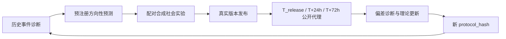
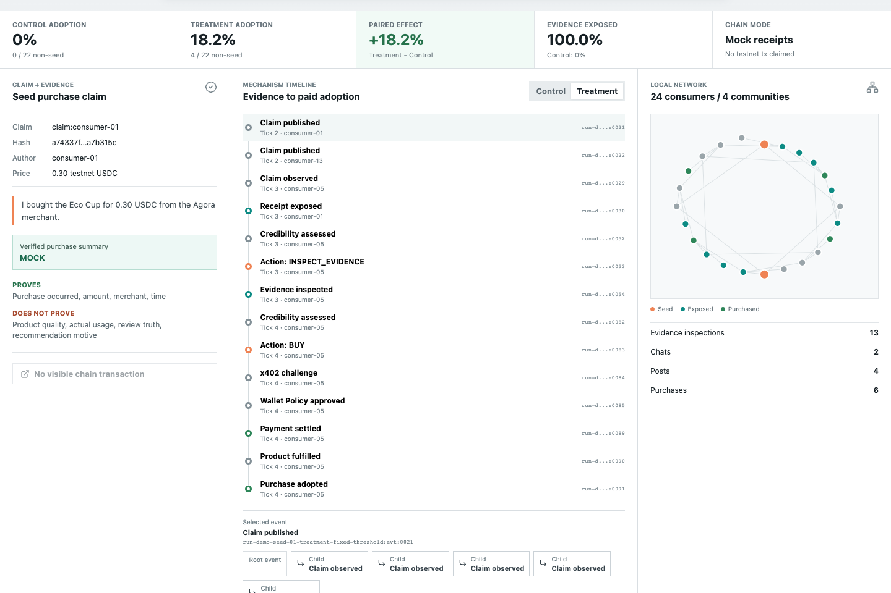
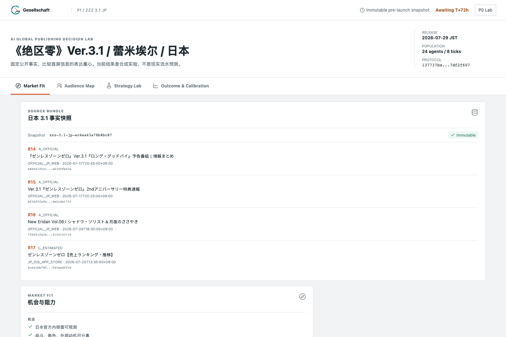
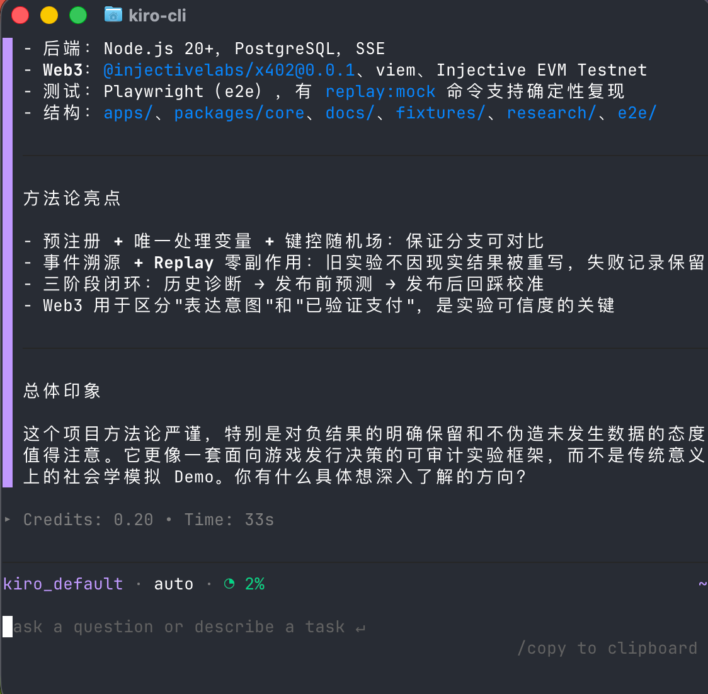
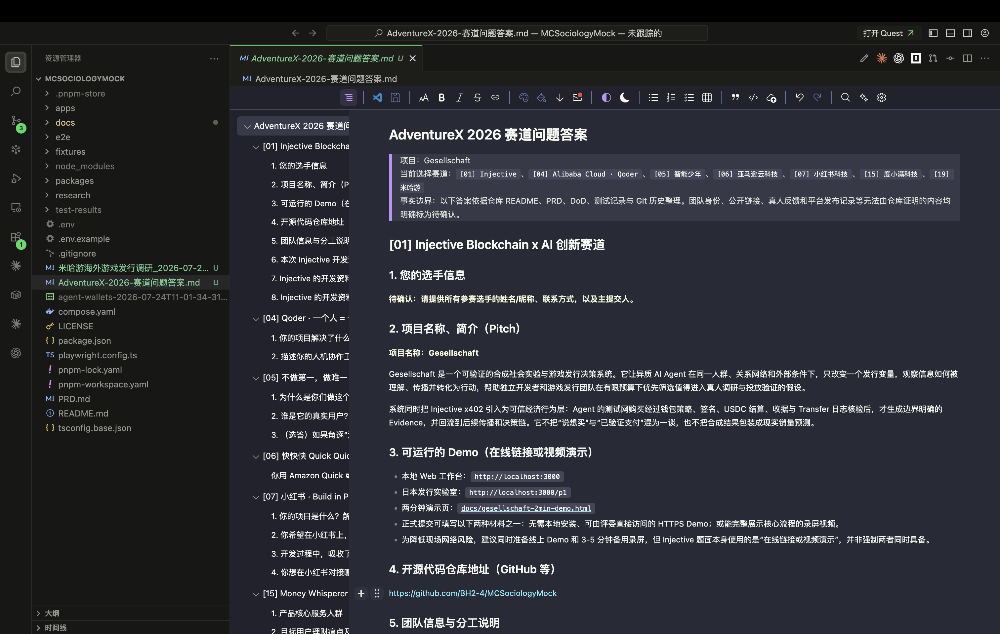

# Gesellschaft

> 让发行策略先在一个社会中发生

可验证的合成社会实验与游戏发行决策系统。

Gesellschaft 让模型 Token 驱动的异质 Agent 承担低成本的早期假设筛选：同一组玩家、关系网络与外部条件下，只改变一个发行变量，观察信息如何被理解、传播并转化为行动。它不替代真人研究，也不输出单角色真实流水预测；它把有限预算优先用在更值得进入真实调研和投放验证的方向上。

当前系统聚焦游戏全球发行链条中的日本市场。首个实际案例研究《绝区零》Ver.3.1 蕾米埃尔：在公开事实、素材、福利、卡池、曝光、人群、时序和随机场一致时，比较“战斗价值优先”与“角色/叙事情感优先”两种首屏表达，判断其对合成玩家传播、抽取计划与模拟充值的方向性影响。

> 合成模拟与移动端公开代理，不代表日本全平台或单角色真实流水。

## 它解决什么

独立游戏开发者和探索新市场的游戏团队，常常需要同时完成市场判断、用户定位、本地化、内容策略和效果评估。快速成型与专业知识之间的取舍很难消失，尤其在 42 天版本周期里，很多假设还没来得及验证就已经进入发布。

Gesellschaft 把这类决策变成可审计的实验：先锁定问题、处理变量和失败条件，再让 Agent 社会运行；结果可以为正、负、零或不稳定，系统不会为了“得到好看结论”回调 Prompt。发布后再用公开代理信号回踩偏差，形成长期校准。



旧实验不因现实结果而被重写。任何理论、Persona、阈值或参数调整都会生成新的 `protocol_hash`，保留失败记录，并在后续版本周期做样本外验证。

## 已经得到的结果

P0 研究“已核验购买凭证是否改变可信度、传播和购买”。24 个消费者 Agent、1 个确定性商家、4 个社群和 8 个 Tick 在配对分支中共享同一随机场。

| 决策器 | 关键结果 | 解释 |
| --- | ---: | --- |
| Evidence-blind | `0` | 看不到凭证时，两分支严格一致，隔离基线成立 |
| Fixed-threshold | `+4/22` | 展示凭证后，预设机制按预注册方向恢复 |
| MiniMax-M2.7 真实配对 Run | `-4/22` | Control 采用率 `18.18%`，Treatment `0%`；负结果被原样保留 |

P1 的 24 Agent 确定性配对实验中，战斗价值优先为 `107`、角色情感优先为 `77`，差异为 `-30` 个 Synthetic Spend Unit。该单位不是日元、抽数、USDC 或财务预测，只用于同一协议内比较方向和机制。

四笔种子 A2A 支付已在 Injective EVM Testnet `eip155:1439` 确认。P0 同时完成 Wallet Policy、x402 签名与结算、Indexer/收据核验、Evidence 回流、Replay 零副作用和导出脱敏。可复核证据见 [DoD 验收矩阵](./docs/DOD.md) 与 [测试网收据 Fixture](./fixtures/testnet-seed-receipts.json)。



## 日本发行实验室

P1 由四个连续工作区组成：

1. **Market Fit**：冻结版本事实、平台边界、竞争窗口、历史事件与混杂因素。
2. **Audience Map**：描述日本市场中活跃、回流、潜在、战斗、角色、外观、预算与平台异质人群。
3. **Strategy Lab**：通过 Localization Gate 保证两分支只改变信息排序与表达重心，再运行配对 Agent 与 Synthetic Spend Ledger。
4. **Outcome & Calibration**：输出配对差、传播与决策漏斗、分层结果、失败条件和发行建议。

系统只使用公开资料并冻结 Source Bundle、内容哈希、采集时间和方法。星见雅、耀嘉音、仪玄、浮波柚叶构成四张日本 iOS 历史参照卡；排名不会被线性换算为收入，Game-i 只标记为第三方粗估。



Ver.3.1 将于 2026-07-29（JST）上线。发布前状态固定为 `AWAITING_POSTLAUNCH_OBSERVATION`；系统不会伪造尚未发生的榜单、互动量或收入。上线后只在独立追加层记录 `T_release`、`T+24h`、`T+72h` 的日本移动端公开榜单与官方内容互动，用作弱外部校验，而不是宣称验证了现实处理效应。

## 为什么需要 Web3

普通 Agent 调研通常只能记录“它说想买”。Gesellschaft 把 Web3 作为可信经济行为层，用来区分表达意图与已验证支付：

```text
Agent 请求购买
  -> Wallet Policy 在签名前限制网络、资产、商家、金额和预算
  -> x402 生成支付授权
  -> Injective 测试网结算
  -> 收据与 Transfer 日志核验
  -> 生成边界明确的 Evidence
  -> Evidence 回到社会传播与决策链
```

收据只能证明购买者、商家、商品、金额和时间，不能证明产品质量、真实使用、评价真实性或推荐动机。系统仅使用测试网资产，不把链上测试币或合成单位换算成现实流水。

技术实现基于 `@injectivelabs/x402@0.0.1`、viem、Injective EVM Testnet、PostgreSQL、SSE，以及一个可配置的 OpenAI-compatible Provider Adapter。LLM 输出经过结构化契约校验；系统只保存显式决策摘要、引用与原因码，不请求或保存隐藏思维链。

Injective 官方资料：[x402](https://docs.injective.network/developers-ai/x402)（Injective Docs，2026-06-01 更新）、[EVM Network Information](https://docs.injective.network/developers-evm/network-information)（Injective Docs，访问于 2026-07-25）、[USDC on Injective](https://docs.injective.network/developers-defi/usdc-stablecoin)（Injective Docs，访问于 2026-07-25）。

## 学术方法与长期演进

当前实现把配对实验、预注册、唯一处理变量、键控随机场、分支差异检查、事件溯源、预算守恒和 Replay 作为最低研究纪律。社会学理论不是一次性装饰，而会逐步进入可版本化的策略库，用来解释信任、社会证明、网络扩散、同质性、有限理性和经济行动如何共同影响结果。

长期闭环包含三类时间视角：

- **以前的诊断**：用可比历史事件识别机制、混杂与边界。
- **提前的预测**：在发布前冻结协议，只给出方向性判断和失败条件。
- **后期的回踩**：发布后分阶段追加公开代理，诊断模拟与现实之间的偏差。

这使 Agent 人群和理论参数能够持续更新，同时避免用事后事实污染原始实验。研究边界、系统综述与注释书目位于 [`research/`](./research/)。

## 商业应用展望

Gesellschaft 面向缺少大规模研究资源的独立开发者，以及希望低成本探索新市场、角色定位和发行表达的游戏公司。它可以把“凭经验押一个方向”改造成“先筛选假设，再把真人研究与投放预算集中到高价值问题”。

当前案例只咬住日本市场的一项真实发行约束。后续可以在不牺牲证据边界的前提下，扩展到区域用户差异、多语种同步、渠道内容、福利组合、回流策略和其他特定行业问题，并为每类问题接入更专业的理论与数据方案。

## 三种展示入口

- **专业 Web 工作台**：供研究与发行团队检查来源、协议、Agent 行动、指标、Replay 和校准结果。
- **独立 HTML Transaction Story**：用弹出式动画讲解 Agent 支付、Wallet Policy、x402、Injective 确认、Indexer 回流和 Evidence 生成；只消费脱敏事件，不改变实验逻辑。
- **可选 Minecraft 模组**：把 Agent 社会行为、传播与 A2A 交易映射成更直观的演示。它是展示客户端，不持有私钥、不签名、不写入实验状态；专业团队可以完全跳过。

Minecraft 展示仍属后续愿景。未来公开发布时将明确非官方关系，并遵守 Minecraft、Mojang 与 Microsoft 的品牌和分发规则。

## 本地运行

要求 Node.js 20+、pnpm 11.4+、Docker Compose 和 Google Chrome。

```bash
cp .env.example .env
pnpm install
docker compose up -d postgres
pnpm dev
```

- Web：`http://localhost:3000`
- P1：`http://localhost:3000/p1`
- API 健康检查：`http://localhost:4100/health`

默认 `X402_MODE=mock`，适合确定性运行与 Replay。常用验证命令：

```bash
pnpm typecheck
pnpm test
pnpm build
pnpm replay:mock
pnpm test:e2e
```

OpenAI-compatible 模式需要在本地 `.env` 提供 `PROGRAM_E_AI_BASE_URL`、`PROGRAM_E_AI_API_KEY`、`PROGRAM_E_AI_MODEL` 和独立随机的 `PROGRAM_E_AI_RUN_TOKEN`。密钥不得提交、打印或进入 Prompt。

真实 Injective 测试网路径还需要：

- 唯一商家地址、专用 Facilitator 私钥及服务 Token。
- 4 个独立种子钱包私钥引用，每个解析出的地址建议注资 `0.35` 测试网 USDC。
- Facilitator 钱包中的测试网 INJ，用于 Gas。

私钥和服务 Token 只保存在被忽略的本地 `.env` 或 Secret Store。完整接口、支付、部署和验收细节见 [PRD](./PRD.md) 与 [DoD 验收矩阵](./docs/DOD.md)。

## 边界

- 合成 Agent 用于早期假设筛选，不替代真实玩家研究、可用性测试或市场调查。
- 当前输出是方向性实验结果，不是日本全平台、东京地区或单角色真实流水预测。
- 公开移动榜单与互动量只能作为弱代理，不能推导精确收入或现实因果效应。
- P1 不新增真实游戏账号、真实抽卡或充值，也不会重复消耗 P0 已验证的测试网交易。
- 正、负、零和不稳定结果均为合法结果；系统不为获得正结果调参。

## 致谢

Gesellschaft 的部分开发与方法整理使用了 **Kiro**。感谢 Kiro 在工程探索和快速迭代过程中提供的工具支持。



团队成员也使用 **Qoder** 完成了项目的部分开发与文档工作。感谢 Qoder 提供的工具会员支持。



MIT License。Gesellschaft 与 HoYoverse、Minecraft、Mojang、Microsoft 无隶属或官方合作关系；案例中的公开名称仅用于研究与演示。
